# Project 001: AI-Powered Interactive Portfolio
## Advanced Conversational AI with Full MCP Protocol Implementation

[](https://choosealicense.com/licenses/mit/)
[](https://modelcontextprotocol.io/)
[](https://github.com/LSG-hub/Project-001)
[](https://github.com/LSG-hub/Project-001)

> **🎯 VISION: Say "Hey Sreenivas" and have a natural conversation with my AI counterpart**

**The Revolutionary Portfolio Concept**: Instead of reading a static resume, visitors can have natural conversations with an AI version of myself that knows everything about my background, projects, and skills. This system showcases cutting-edge AI technology while demonstrating my technical expertise through practical implementation.

**Technical Innovation**: A comprehensive implementation of Anthropic's Model Context Protocol (MCP) featuring server-initiated intelligence, autonomous analysis, real-time subscriptions, and distributed AI architecture - positioning this at the forefront of modern AI system design.

> **📋 Note**: This README serves as a comprehensive 0-to-hero guide for building an advanced AI portfolio system. For optimal diagram viewing, open on GitHub or use a Markdown viewer like VS Code.

## 📋 Table of Contents

- [The Vision & Problem](#-the-vision--problem)
- [Strategic Innovation](#-strategic-innovation)
- [Advanced System Architecture](#️-advanced-system-architecture)
- [Intelligent Data Flow](#-intelligent-data-flow)
- [Full MCP Protocol Implementation](#️-full-mcp-protocol-implementation)
- [Advanced Database Design](#️-advanced-database-design)
- [Distributed MCP Servers](#-distributed-mcp-servers)
- [API Architecture](#-api-architecture)
- [Authentication & Security](#-authentication--security)
- [Real-time Intelligence Systems](#-real-time-intelligence-systems)
- [User Experience Scenarios](#-user-experience-scenarios)
- [Technical Innovation Showcase](#️-technical-innovation-showcase)
- [Development Roadmap](#-development-roadmap)
- [Implementation Guide](#-implementation-guide)
- [System Requirements](#-system-requirements)
- [Production Architecture](#-production-architecture)
- [Performance & Monitoring](#-performance--monitoring)
- [Security & Privacy](#-security--privacy)
- [Testing Strategy](#-testing-strategy)
- [Getting Started](#-getting-started)

## 🎯 The Vision & Problem

### The Problem with Traditional Portfolios
Static portfolios and resumes are one-way presentations that can't:
- Answer follow-up questions or provide specific details on demand
- Adapt explanations to what visitors are most interested in
- Create meaningful interactions or demonstrate personality
- Showcase technical capabilities through practical implementation
- Provide real-time demonstrations or live project insights

### Our Revolutionary Solution
**A Digital Version of Me**: An intelligent AI assistant that represents my professional identity through natural conversation, powered by cutting-edge technology that demonstrates my AI/ML expertise in practice.

**What Visitors Experience:**
- Natural voice or text conversations about my background
- Personalized explanations based on their specific interests
- Live demonstrations of projects with real-time data
- Contextual follow-up discussions that build understanding
- A memorable, engaging way to learn about my work

**What This Demonstrates:**
- Advanced AI/ML implementation skills through practical application
- Understanding of modern conversational AI architecture
- Ability to build production-grade distributed systems
- Innovation in human-computer interaction design
- Technical leadership in emerging AI technologies

## 🚀 Strategic Innovation

### Beyond Basic AI Portfolios
Most AI portfolio projects implement simple chatbots or basic tool-calling patterns. Project 001 demonstrates mastery of advanced AI system architecture through comprehensive MCP protocol implementation.

### Our Advanced Approach
**🧠 Server-Initiated Intelligence**: AI servers that autonomously analyze data and request additional processing from Claude based on their findings

**📊 Multi-Modal Resource Management**: Browsable documents, schemas, and live data that Claude can explore dynamically during conversations

**⚡ Real-Time Orchestration**: Streaming updates, live subscriptions, and bidirectional communication between servers and users

**🤝 Interactive Elicitation**: Two-way conversations where servers can ask users for clarification, confirmation, or additional input

**🔄 Distributed Architecture**: Multiple specialized AI servers with OAuth-secured communication and autonomous decision-making

### Business Impact Demonstration
This system showcases capabilities essential for senior AI/ML roles:
- **Production-grade AI architecture** for enterprise scalability
- **Advanced protocol mastery** for cutting-edge AI research
- **Autonomous agent design** for next-generation AI products
- **Real-time intelligence systems** for modern applications
- **Distributed system orchestration** for cloud-native solutions

## 🏗️ Advanced System Architecture

Our planned architecture demonstrates enterprise-grade distributed AI system design with full MCP protocol utilization, autonomous intelligence, and production-scale capabilities.

```mermaid
graph TB
    subgraph "🌐 Global CDN & Edge Layer"
        CDN[CloudFlare CDN + DDoS Protection]
        Edge[Edge Computing Nodes]
        Cache[Intelligent Edge Caching]
    end
    
    subgraph "🖥️ Client Applications"
        Web[Next.js PWA + Advanced Voice Interface]
        Mobile[React Native Mobile App]
        Desktop[Electron Desktop Application]
    end
    
    subgraph "🚪 Enterprise API Gateway"
        Gateway[FastAPI Gateway + Load Balancer]
        Auth[OAuth 2.1 + JWT + Risk Assessment]
        RateLimit[Intelligent Rate Limiting]
        Monitor[Request Tracing + Analytics]
        Proxy[MCP Protocol Proxy]
    end
    
    subgraph "🧠 Central MCP Orchestrator"
        Coordinator[Request Coordinator]
        Router[Intelligent Server Router]
        Context[Context Assembly Engine]
        Stream[Real-time Stream Manager]
        Analytics[Intelligence Analytics]
    end
    
    subgraph "⚙️ Distributed MCP Server Cluster"
        ProfileIntel["Profile Intelligence Server<br/>🔸 Autonomous user modeling<br/>🔸 Behavioral analysis<br/>🔸 Sampling: Claude-powered insights"]
        
        MemoryIntel["Cognitive Memory Server<br/>🔸 Multi-layered conversation memory<br/>🔸 Knowledge graph construction<br/>🔸 Elicitation: context clarification"]
        
        ProjectAnalytics["Project Analytics Server<br/>🔸 Real-time project metrics<br/>🔸 Live demo orchestration<br/>🔸 Resources: browsable documentation"]
        
        KnowledgeIntel["Knowledge Intelligence Server<br/>🔸 Semantic search + RAG<br/>🔸 Dynamic content analysis<br/>🔸 Prompts: query optimization templates"]
        
        QueryIntel["Query Intelligence Server<br/>🔸 Natural language to SQL<br/>🔸 Risk assessment + confirmation<br/>🔸 Sampling: query optimization"]
        
        ResourceMgr["Resource Management Server<br/>🔸 Document browsing<br/>🔸 Schema exploration<br/>🔸 Subscriptions: real-time updates"]
        
        ExternalIntel["External Integration Server<br/>🔸 GitHub/LinkedIn integration<br/>🔸 Live data synchronization<br/>🔸 OAuth: secure connections"]
    end
    
    subgraph "📊 Advanced Data Layer"
        PrimaryDB[(Primary PostgreSQL + pgvector)]
        ReadReplicas[(Multi-Region Read Replicas)]
        VectorStore[Specialized Vector Database]
        RedisCluster[Redis Cluster + Session Store]
        AnalyticsWarehouse[Analytics Data Warehouse]
        StreamingData[Real-time Streaming Platform]
    end
    
    subgraph "🤖 AI & ML Services"
        Claude[Claude API + Anthropic]
        LocalModels[Local Model Inference]
        SpeechServices[Advanced Speech Processing]
        VisionServices[Computer Vision APIs]
        MLPipeline[Custom ML Pipeline]
    end
    
    subgraph "📈 Enterprise Observability"
        Metrics[Prometheus + Grafana]
        Logging[ELK Stack + Distributed Tracing]
        Security[SIEM + Threat Detection]
        Alerts[PagerDuty + Automated Response]
        AIMonitoring[AI Performance Analytics]
    end
    
    CDN --> Web
    CDN --> Mobile
    CDN --> Desktop
    Edge --> Gateway
    Cache --> Gateway
    
    Web --> Gateway
    Mobile --> Gateway
    Desktop --> Gateway
    
    Gateway --> Auth
    Auth --> RateLimit
    RateLimit --> Monitor
    Monitor --> Proxy
    Proxy --> Coordinator
    
    Coordinator --> Router
    Router --> Context
    Context --> Stream
    Stream --> Analytics
    
    Router --> ProfileIntel
    Router --> MemoryIntel
    Router --> ProjectAnalytics
    Router --> KnowledgeIntel
    Router --> QueryIntel
    Router --> ResourceMgr
    Router --> ExternalIntel
    
    ProfileIntel --> PrimaryDB
    MemoryIntel --> VectorStore
    ProjectAnalytics --> AnalyticsWarehouse
    KnowledgeIntel --> ReadReplicas
    QueryIntel --> PrimaryDB
    ResourceMgr --> StreamingData
    ExternalIntel --> RedisCluster
    
    Router --> Claude
    ProfileIntel --> LocalModels
    Context --> SpeechServices
    Analytics --> VisionServices
    Stream --> MLPipeline
    
    Gateway --> Metrics
    Coordinator --> Logging
    Router --> Security
    Analytics --> Alerts
    Stream --> AIMonitoring
```



### Architecture Innovation Principles

**🔄 Autonomous Intelligence**: Each MCP server operates as an independent AI-powered service capable of requesting Claude's analysis, making decisions, and initiating workflows without explicit user commands.

**📡 Real-Time Intelligence**: Event-driven architecture with streaming data, live subscriptions, and immediate response to system changes and user interactions.

**🛡️ Zero-Trust Security**: Every request authenticated, authorized, and audited with OAuth 2.1, comprehensive logging, and behavioral analysis.

**⚡ Global Scale Design**: Multi-region deployment with edge computing, intelligent caching, and sub-200ms response times worldwide.

**🧠 Distributed Cognition**: Multiple specialized AI servers working together, sharing context and insights to provide comprehensive responses.

## 🔄 Intelligent Data Flow

### Advanced Request Processing with Full MCP Capabilities

This sequence demonstrates how our planned system utilizes the complete MCP protocol stack for sophisticated AI interactions with autonomous intelligence and real-time coordination.


### Autonomous Intelligence Workflows


## 🛠️ Full MCP Protocol Implementation

Our system demonstrates complete mastery of the Model Context Protocol through comprehensive implementation of all primitives and advanced features.

### MCP Protocol Coverage Matrix

```mermaid
graph TB
    subgraph "📚 Core MCP Primitives"
        Tools["🔧 Tools (Executable Functions)<br/>• profile_intelligence_analyze<br/>• memory_contextual_search<br/>• project_performance_metrics<br/>• demo_interactive_launch<br/>• query_optimization_execute<br/>• resource_subscription_manage"]
        
        Resources["📊 Resources (Browsable Data)<br/>• profile://complete_resume_cv<br/>• projects://live_documentation<br/>• analytics://real_time_dashboards<br/>• knowledge://semantic_database<br/>• schemas://system_architecture<br/>• demos://interactive_previews"]
        
        Prompts["📝 Prompts (Behavioral Templates)<br/>• conversation_style_guidelines<br/>• technical_explanation_patterns<br/>• project_presentation_frameworks<br/>• user_interaction_examples<br/>• code_review_standards<br/>• demo_presentation_scripts"]
    end
    
    subgraph "⚡ Advanced MCP Features"
        Sampling["🧠 Sampling (Server-Initiated AI)<br/>• autonomous_user_analysis<br/>• intelligent_content_generation<br/>• predictive_conversation_routing<br/>• proactive_insight_discovery<br/>• behavioral_pattern_analysis<br/>• contextual_recommendation_engine"]
        
        Elicitation["❓ Elicitation (Interactive Dialogs)<br/>• clarification_request_system<br/>• confirmation_dialog_manager<br/>• preference_gathering_workflows<br/>• risk_assessment_confirmations<br/>• interactive_configuration_wizards<br/>• contextual_feedback_collection"]
        
        Subscriptions["📡 Subscriptions (Real-time Streams)<br/>• live_project_status_updates<br/>• performance_metric_streams<br/>• user_behavior_notifications<br/>• system_health_monitoring<br/>• security_event_alerts<br/>• conversation_analytics_feeds"]
    end
    
    subgraph "🎯 Intelligent Coordination"
        Discovery["🔍 Dynamic Discovery<br/>• automatic_capability_detection<br/>• intelligent_server_routing<br/>• context_aware_tool_selection<br/>• adaptive_workflow_orchestration<br/>• capability_matching_algorithms"]
        
        Optimization["⚡ Performance Intelligence<br/>• parallel_execution_optimization<br/>• intelligent_caching_strategies<br/>• cost_aware_model_routing<br/>• latency_optimization_engine<br/>• resource_allocation_management"]
        
        Security["🔒 Enterprise Security<br/>• oauth_secured_communications<br/>• zero_trust_architecture<br/>• comprehensive_audit_trails<br/>• threat_detection_integration<br/>• compliance_monitoring_system"]
    end
    
    Tools --> Sampling
    Resources --> Subscriptions
    Prompts --> Elicitation
    Sampling --> Discovery
    Elicitation --> Optimization
    Subscriptions --> Security
```



### Implementation Examples

**🧠 Server-Initiated Intelligence (Sampling):**
```python
# Profile Intelligence Server autonomously analyzes user behavior
@mcp_tool(name="autonomous_user_modeling")
async def analyze_user_autonomously(user_id: str):
    # Server gathers context and requests Claude's analysis
    user_behavior = await gather_interaction_patterns(user_id)
    conversation_history = await get_recent_conversations(user_id)
    
    # Server initiates AI analysis without user request
    insights = await sample_claude_completion(
        prompt=f"""
        Analyze this user's behavior patterns and conversation history:
        Behavior: {user_behavior}
        Conversations: {conversation_history}
        
        Provide insights on:
        1. Technical interests and expertise level
        2. Preferred communication style
        3. Topics they're most engaged with
        4. Optimal conversation approach
        """,
        temperature=0.3,
        max_tokens=800
    )
    
    # Server makes autonomous decisions based on insights
    personalization_updates = await process_behavioral_insights(insights)
    await update_user_profile_autonomously(user_id, personalization_updates)
    
    return {
        "autonomous_insights": insights,
        "personalization_applied": personalization_updates,
        "confidence_score": calculate_insight_confidence(insights),
        "next_conversation_strategy": generate_conversation_strategy(insights)
    }
```

**📊 Resources - Browsable Data:**
```python
# Expose complete documents as browsable resources
@mcp_resource(uri="profile://complete_resume")
async def provide_complete_resume():
    return {
        "content": await load_complete_cv_document(),
        "metadata": {
            "sections": ["education", "experience", "projects", "skills"],
            "last_updated": datetime.now(),
            "detail_level": "comprehensive"
        },
        "browsable_sections": {
            "education": "profile://education_details",
            "projects": "projects://all_projects",
            "technical_skills": "profile://technical_expertise"
        }
    }

@mcp_resource(uri="projects://smartrfp/documentation")
async def provide_project_documentation():
    return {
        "readme": await load_project_readme("smartrfp"),
        "technical_docs": await load_technical_specifications("smartrfp"),
        "live_metrics": await get_real_time_metrics("smartrfp"),
        "demo_links": await get_interactive_demo_urls("smartrfp"),
        "code_samples": await get_representative_code_snippets("smartrfp")
    }
```

**📝 Prompts - Behavioral Templates:**
```python
@mcp_prompt(name="technical_project_explanation")
async def get_technical_explanation_template():
    return """
    When explaining technical projects, follow this structured approach:
    
    1. **Problem Statement** (30 seconds): What specific problem does this solve?
    2. **Technical Architecture** (60 seconds): High-level system design and key components
    3. **Innovation Highlights** (45 seconds): What makes this technically interesting or challenging?
    4. **Impact & Results** (30 seconds): Measurable outcomes and business value
    5. **Interactive Elements** (if available): Offer live demos, code examples, or detailed dives
    
    Example response pattern:
    "SmartRFP solves the problem of manual proposal analysis by automating document processing using NLP. 
    The system uses a microservices architecture with FastAPI, PostgreSQL, and Claude integration for intelligent analysis.
    The innovation lies in combining semantic search with structured data extraction for comprehensive insights.
    This resulted in 80% time savings for proposal reviews and 95% accuracy in key information extraction.
    Would you like me to show you a live demo or dive deeper into the NLP pipeline?"
    
    Adapt tone based on user expertise level:
    - Technical users: Include architecture details, tech stack specifics
    - Business users: Focus on problems solved, ROI, impact metrics
    - Casual visitors: Use analogies, focus on practical benefits
    """

@mcp_prompt(name="conversation_personalization")
async def get_personalization_guidelines():
    return """
    Personalize responses based on user context:
    
    User Type Detection:
    - **Recruiters**: Focus on skills, experience, cultural fit, availability
    - **Technical Peers**: Dive into architecture, code quality, problem-solving approach
    - **Potential Collaborators**: Emphasize working style, project interests, mutual benefits
    - **Students/Learners**: Educational explanations, learning resources, career guidance
    
    Conversation History Integration:
    - Reference previous discussions naturally
    - Build on established context
    - Avoid repeating information already covered
    - Suggest related topics they haven't explored
    
    Engagement Optimization:
    - Ask follow-up questions to maintain engagement
    - Offer interactive elements (demos, code examples)
    - Suggest subscription to relevant updates
    - Provide multiple engagement pathways
    """
```

**❓ Interactive Elicitation:**
```python
@mcp_tool(name="intelligent_project_recommendation")
async def recommend_project_with_clarification(user_context: dict):
    # Analyze user context for project matching
    project_matches = await analyze_project_relevance(user_context)
    
    if len(project_matches) > 1:
        # Use elicitation to clarify user preferences
        preference = await elicit_user_input(
            prompt="I can show you several relevant projects. What interests you most?",
            input_type="single_choice",
            options=[
                "AI/ML applications with real business impact",
                "Full-stack development with modern architecture", 
                "Innovative user interfaces and interaction design",
                "Backend systems and API development",
                "Show me your most technically challenging project"
            ],
            context="project_selection",
            timeout_seconds=30
        )
        
        # Refine recommendations based on user input
        refined_matches = await refine_project_selection(project_matches, preference)
        return await prepare_project_presentation(refined_matches[0], preference)
    
    return await prepare_project_presentation(project_matches[0])

@mcp_tool(name="secure_query_execution")
async def execute_database_query(sql: str, user_id: str):
    # Assess query risk and complexity
    risk_assessment = await analyze_query_risk(sql)
    
    if risk_assessment["risk_level"] > 0.7:
        # Request confirmation with detailed information
        confirmation = await elicit_user_input(
            prompt=f"""
            This query will access sensitive data and may take {risk_assessment['estimated_time']} to execute.
            
            Query: {sql}
            Data accessed: {risk_assessment['tables_accessed']}
            Estimated cost: ${risk_assessment['estimated_cost']}
            
            Would you like to proceed?
            """,
            input_type="confirmation",
            options=["Yes, execute the query", "No, cancel", "Show me what data this accesses", "Suggest a safer alternative"],
            context="database_query_confirmation",
            timeout_seconds=60
        )
        
        if confirmation == "Show me what data this accesses":
            return await show_query_data_preview(sql)
        elif confirmation == "Suggest a safer alternative":
            return await suggest_alternative_query(sql, risk_assessment)
        elif confirmation != "Yes, execute the query":
            return {"status": "cancelled", "reason": confirmation}
    
    return await execute_monitored_query(sql, user_id, risk_assessment)
```

**📡 Real-time Subscriptions:**
```python
@mcp_subscription(resource="analytics://live_performance")
async def stream_performance_metrics(user_id: str, filters: dict = None):
    # Establish real-time subscription to performance data
    while True:
        metrics = await gather_real_time_metrics(filters)
        
        # Intelligent filtering based on user preferences
        personalized_metrics = await personalize_metrics(metrics, user_id)
        
        yield {
            "timestamp": datetime.now(),
            "metrics": personalized_metrics,
            "alerts": await check_performance_alerts(metrics),
            "recommendations": await generate_optimization_suggestions(metrics),
            "subscription_id": f"perf_{user_id}_{datetime.now().timestamp()}"
        }
        
        await asyncio.sleep(5)  # Update every 5 seconds

@mcp_subscription(resource="projects://status_updates")
async def stream_project_updates(user_id: str, project_filter: str = "all"):
    # Subscribe to real-time project status changes
    async for update in monitor_project_changes(project_filter):
        # Intelligent notification based on user interests
        if await should_notify_user(user_id, update):
            yield {
                "project": update["project_name"],
                "status": update["status"],
                "details": update["details"],
                "impact": await assess_update_relevance(update, user_id),
                "timestamp": update["timestamp"]
            }
```

## 🗄️ Advanced Database Design

Our database architecture supports sophisticated AI workflows, autonomous intelligence, real-time analytics, and enterprise-grade security with comprehensive audit capabilities.


### Advanced Database Features

**🧠 Intelligent Indexing Strategy:**
```sql
-- Vector search optimization for semantic understanding
CREATE INDEX idx_conversations_embedding ON conversations USING ivfflat (content_embedding vector_cosine_ops);
CREATE INDEX idx_memory_semantic ON memory_layers USING ivfflat (semantic_embedding vector_cosine_ops);
CREATE INDEX idx_resources_content ON mcp_resources USING ivfflat (content_embedding vector_cosine_ops);

-- Performance optimization for real-time queries
CREATE INDEX idx_conversations_session_time ON conversations(session_id, created_at DESC);
CREATE INDEX idx_mcp_tools_performance ON mcp_tools(server_id, success_rate DESC, avg_execution_time_ms);
CREATE INDEX idx_user_behavior ON memory_layers(user_id, memory_type, importance_score DESC);
CREATE INDEX idx_real_time_events ON real_time_events(event_type, processing_status, created_at DESC);

-- Advanced analytics optimization
CREATE INDEX idx_user_intelligence_patterns ON user_intelligence USING GIN (behavioral_patterns);
CREATE INDEX idx_conversation_analytics ON conversation_analytics USING GIN (metrics);
CREATE INDEX idx_mcp_sampling_context ON mcp_sampling_events USING GIN (input_context);
```

**🔒 Advanced Row-Level Security:**
```sql
-- User data isolation with behavioral analysis
CREATE POLICY user_data_isolation ON conversations
  USING (session_id IN (
    SELECT id FROM sessions 
    WHERE user_id = current_setting('app.current_user_id')::uuid
  ));

-- MCP server access control
CREATE POLICY mcp_server_access ON mcp_tools
  USING (server_id IN (
    SELECT id FROM mcp_servers 
    WHERE is_active = true 
    AND current_setting('app.mcp_server_role') = ANY(string_to_array(security_config::text, ','))
  ));

-- Intelligent security with risk assessment
CREATE POLICY admin_security_override ON security_audit
  USING (
    current_setting('app.current_role') = 'admin' 
    OR current_setting('app.security_clearance')::int >= 3
    OR (risk_assessment != 'high' AND user_id = current_setting('app.current_user_id')::uuid)
  );
```

**📊 Real-time Analytics Views:**
```sql
-- Live performance dashboard
CREATE MATERIALIZED VIEW live_performance_dashboard AS
SELECT 
    DATE_TRUNC('hour', created_at) as hour,
    COUNT(*) as total_requests,
    AVG(avg_execution_time_ms) as avg_response_time,
    AVG(success_rate) as avg_success_rate,
    SUM(CASE WHEN success_rate < 0.95 THEN 1 ELSE 0 END) as degraded_tools
FROM mcp_tools 
GROUP BY DATE_TRUNC('hour', created_at);

-- User engagement analytics
CREATE MATERIALIZED VIEW user_engagement_metrics AS
SELECT 
    u.id as user_id,
    COUNT(DISTINCT s.id) as total_sessions,
    AVG(s.session_score) as avg_engagement,
    COUNT(DISTINCT c.id) as total_conversations,
    AVG(ca.quality_scores->>'overall') as conversation_quality
FROM users u
LEFT JOIN sessions s ON u.id = s.user_id
LEFT JOIN conversations c ON s.id = c.session_id
LEFT JOIN conversation_analytics ca ON s.id = ca.session_id
GROUP BY u.id;

-- MCP intelligence effectiveness
CREATE MATERIALIZED VIEW mcp_intelligence_metrics AS
SELECT 
    server_name,
    COUNT(mse.id) as sampling_events,
    AVG(mse.processing_time_ms) as avg_sampling_time,
    COUNT(mee.id) as elicitation_events,
    AVG(mee.response_time_ms) as avg_elicitation_time,
    COUNT(ms.id) as active_subscriptions
FROM mcp_servers ms
LEFT JOIN mcp_sampling_events mse ON ms.id = mse.server_id
LEFT JOIN mcp_elicitation_events mee ON ms.id = mee.server_id
LEFT JOIN mcp_subscriptions msu ON ms.id = msu.resource_id
GROUP BY ms.id, server_name;
```

## ⚙️ Distributed MCP Servers

Our planned distributed architecture demonstrates production-grade MCP implementation with comprehensive protocol utilization and autonomous intelligence capabilities.

### MCP Server Cluster Architecture

```mermaid
graph TB
    subgraph "🎛️ Central MCP Orchestrator"
        Coordinator[Request Coordinator + Load Balancer]
        Router[Intelligent Server Router + Context Manager]
        Analytics[Intelligence Analytics + Decision Engine]
        Stream[Real-time Stream Manager + Event Hub]
    end
    
    subgraph "🧠 Autonomous Intelligence Servers"
        ProfileIntel["Profile Intelligence Server<br/>🔸 OAuth: Secure user data access<br/>🔸 Tools: Advanced behavioral modeling<br/>🔸 Resources: Complete user profiles<br/>🔸 Prompts: Personalization templates<br/>🔸 Sampling: Autonomous user analysis<br/>🔸 Elicitation: Preference clarification"]
        
        MemoryIntel["Cognitive Memory Server<br/>🔸 OAuth: Context access control<br/>🔸 Tools: Multi-layered memory management<br/>🔸 Resources: Knowledge graphs<br/>🔸 Prompts: Memory integration patterns<br/>🔸 Sampling: Context optimization<br/>🔸 Elicitation: Ambiguity resolution"]
    end
    
    subgraph "📊 Analytics & Performance Servers"
        ProjectAnalytics["Project Analytics Server<br/>🔸 OAuth: Project data security<br/>🔸 Tools: Performance metrics analysis<br/>🔸 Resources: Live project dashboards<br/>🔸 Prompts: Technical explanation templates<br/>🔸 Sampling: Usage pattern analysis<br/>🔸 Subscriptions: Real-time project updates"]
        
        ConversationAnalytics["Conversation Analytics Server<br/>🔸 OAuth: Analytics access control<br/>🔸 Tools: Sentiment & engagement analysis<br/>🔸 Resources: Conversation insights<br/>🔸 Prompts: Analysis report templates<br/>🔸 Sampling: Quality assessment<br/>🔸 Subscriptions: Engagement alerts"]
    end
    
    subgraph "🎯 Interactive & Demo Servers"
        DemoOrchestrator["Demo Orchestration Server<br/>🔸 OAuth: Demo environment access<br/>🔸 Tools: Interactive demo management<br/>🔸 Resources: Live application previews<br/>🔸 Prompts: Demo presentation scripts<br/>🔸 Sampling: Demo optimization<br/>🔸 Notifications: Demo status updates"]
        
        QueryIntel["Query Intelligence Server<br/>🔸 OAuth: Database access control<br/>🔸 Tools: NL to SQL + optimization<br/>🔸 Resources: Schema documentation<br/>🔸 Prompts: Query explanation templates<br/>🔸 Sampling: Query pattern analysis<br/>🔸 Elicitation: Risk confirmations"]
    end
    
    subgraph "🔗 Integration & Resource Servers"
        ResourceMgr["Resource Management Server<br/>🔸 OAuth: Resource access control<br/>🔸 Tools: Document + schema browsing<br/>🔸 Resources: File system + external data<br/>🔸 Prompts: Resource explanation templates<br/>🔸 Sampling: Content analysis<br/>🔸 Subscriptions: Real-time file monitoring"]
        
        ExternalInteg["External Integration Server<br/>🔸 OAuth: Third-party API security<br/>🔸 Tools: GitHub + LinkedIn integration<br/>🔸 Resources: External data streams<br/>🔸 Prompts: Integration explanation templates<br/>🔸 Sampling: Data freshness analysis<br/>🔸 Subscriptions: External event monitoring"]
    end
    
    Coordinator --> Router
    Router --> Analytics
    Analytics --> Stream
    
    Router --> ProfileIntel
    Router --> MemoryIntel
    Router --> ProjectAnalytics
    Router --> ConversationAnalytics
    Router --> DemoOrchestrator
    Router --> QueryIntel
    Router --> ResourceMgr
    Router --> ExternalInteg
    
    ProfileIntel -.->|Behavioral Insights| MemoryIntel
    MemoryIntel -.->|Context Enhancement| ProjectAnalytics
    ProjectAnalytics -.->|Performance Data| ConversationAnalytics
    DemoOrchestrator -.->|Demo Metrics| ProjectAnalytics
    QueryIntel -.->|Query Patterns| ResourceMgr
    ResourceMgr -.->|Content Updates| ExternalInteg
```



### Complete MCP Protocol Implementation Matrix

**Full Protocol Coverage Across All Servers:**

| Server | Tools | Resources | Prompts | Sampling | Elicitation | Subscriptions | OAuth |
|--------|-------|-----------|---------|----------|-------------|---------------|--------|
| **Profile Intelligence** | ✅ User modeling & analysis | ✅ Complete profiles & preferences | ✅ Personalization templates | ✅ Autonomous behavioral analysis | ✅ Preference clarification | ✅ Profile change notifications | ✅ Secure user data access |
| **Cognitive Memory** | ✅ Context management & retrieval | ✅ Knowledge graphs & memories | ✅ Memory integration patterns | ✅ Smart context optimization | ✅ Ambiguity resolution | ✅ Memory update notifications | ✅ Context access control |
| **Project Analytics** | ✅ Metrics calculation & analysis | ✅ Live performance dashboards | ✅ Technical explanation templates | ✅ Usage pattern analysis | ✅ Demo permission requests | ✅ Real-time metrics streams | ✅ Project data security |
| **Conversation Analytics** | ✅ Sentiment & engagement analysis | ✅ Conversation quality reports | ✅ Analysis report templates | ✅ Quality pattern assessment | ✅ Feedback collection dialogs | ✅ Engagement alert streams | ✅ Analytics access control |
| **Demo Orchestration** | ✅ Interactive demo management | ✅ Live application previews | ✅ Demo presentation scripts | ✅ Demo experience optimization | ✅ User permission confirmations | ✅ Demo status notifications | ✅ Demo environment access |
| **Query Intelligence** | ✅ NL to SQL + optimization | ✅ Database schema documentation | ✅ Query explanation templates | ✅ Query pattern analysis | ✅ Risk assessment confirmations | ✅ Query result streams | ✅ Database access control |
| **Resource Management** | ✅ Document & schema browsing | ✅ File systems & external data | ✅ Resource explanation templates | ✅ Content relevance analysis | ✅ Access permission requests | ✅ File change notifications | ✅ Resource access control |
| **External Integration** | ✅ Third-party API integration | ✅ External data streams | ✅ Integration explanation templates | ✅ Data freshness analysis | ✅ Integration confirmations | ✅ External event streams | ✅ API security management |

### Server Communication Patterns

**🔒 OAuth-Secured Inter-Server Communication:**
```python
# Secure server-to-server communication
class SecureMCPCommunication:
    async def authenticate_server_request(self, source_server: str, target_server: str):
        # Generate short-lived token for inter-server communication
        token = await self.generate_server_token(source_server, target_server)
        return {
            "Authorization": f"Bearer {token}",
            "X-MCP-Source-Server": source_server,
            "X-MCP-Request-ID": generate_request_id()
        }
    
    async def coordinate_intelligence_sharing(self):
        # ProfileServer shares insights with MemoryServer
        profile_insights = await self.profile_server.sample_user_analysis(user_id)
        await self.memory_server.integrate_behavioral_insights(profile_insights)
        
        # MemoryServer enhances ProjectServer context
        enhanced_context = await self.memory_server.enrich_project_context(project_id)
        await self.project_server.update_presentation_strategy(enhanced_context)
```

**⚡ Event-Driven Coordination:**
```python
# Real-time event streaming between servers
class MCPEventOrchestration:
    async def handle_user_interaction_event(self, event):
        # Parallel processing across multiple servers
        await asyncio.gather(
            self.profile_server.update_engagement_metrics(event),
            self.memory_server.store_interaction_context(event),
            self.analytics_server.analyze_conversation_quality(event),
            self.resource_server.track_resource_access(event)
        )
    
    async def coordinate_autonomous_analysis(self, trigger_event):
        # Server-initiated intelligence coordination
        analysis_tasks = []
        
        if trigger_event.type == "user_engagement_pattern":
            analysis_tasks.append(
                self.profile_server.sample_engagement_analysis(trigger_event.user_id)
            )
            analysis_tasks.append(
                self.conversation_server.sample_quality_assessment(trigger_event.session_id)
            )
        
        results = await asyncio.gather(*analysis_tasks)
        await self.coordinate_insights_integration(results)
```

**🧠 Intelligent Load Balancing:**
```python
# Cost and performance optimized routing
class IntelligentMCPRouter:
    async def route_request_optimally(self, request):
        if request.complexity_score < 0.3:
            # Simple queries → Local models for cost efficiency
            return await self.route_to_local_inference(request)
        elif request.requires_deep_analysis:
            # Complex analysis → Claude API for quality
            return await self.route_to_claude_api(request)
        elif request.is_real_time:
            # Streaming data → Edge computing for latency
            return await self.route_to_edge_processing(request)
        
        return await self.route_to_default_processing(request)
    
    async def optimize_server_coordination(self, multi_server_request):
        # Parallel execution optimization
        server_capabilities = await self.assess_server_loads()
        optimal_distribution = await self.calculate_optimal_routing(
            request=multi_server_request,
            server_status=server_capabilities
        )
        
        return await self.execute_distributed_request(optimal_distribution)
```

## 🔌 API Architecture

### Enterprise-Grade API Design with Full MCP Integration

```mermaid
graph TB
    subgraph "🌐 External Interfaces"
        Public["Public APIs<br/>🔸 Authentication & registration<br/>🔸 Main chat interface<br/>🔸 Health checks & status<br/>🔸 Public documentation"]
        
        Webhooks["Webhook Endpoints<br/>🔸 GitHub integration events<br/>🔸 LinkedIn profile updates<br/>🔸 External system notifications<br/>🔸 Third-party data feeds"]
        
        Voice["Voice Interface APIs<br/>🔸 Speech-to-text processing<br/>🔸 Text-to-speech synthesis<br/>🔸 Wake word detection<br/>🔸 Real-time audio streaming"]
    end
    
    subgraph "🔐 Authenticated User APIs"
        UserMgmt["User Management<br/>🔸 Profile configuration<br/>🔸 Conversation history<br/>🔸 Privacy controls<br/>🔸 Data export/import"]
        
        Subscriptions["Subscription Management<br/>🔸 Real-time subscriptions<br/>🔸 Notification preferences<br/>🔸 Custom alerts<br/>🔸 Subscription analytics"]
        
        Analytics["Personal Analytics<br/>🔸 Conversation insights<br/>🔸 Engagement metrics<br/>🔸 Interest analysis<br/>🔸 Usage patterns"]
    end
    
    subgraph "👑 Admin & Monitoring APIs"
        AdminMgmt["System Administration<br/>🔸 User management<br/>🔸 System configuration<br/>🔸 Performance monitoring<br/>🔸 Security oversight"]
        
        MCPAdmin["MCP Server Management<br/>🔸 Server health monitoring<br/>🔸 Capability discovery<br/>🔸 Performance optimization<br/>🔸 Load balancing control"]
        
        BusinessIntel["Business Intelligence<br/>🔸 Usage analytics<br/>🔸 Cost optimization<br/>🔸 Performance metrics<br/>🔸 ROI analysis"]
    end
    
    subgraph "🔒 Internal MCP APIs"
        MCPCore["Core MCP Endpoints<br/>🔸 Tool invocation<br/>🔸 Resource browsing<br/>🔸 Prompt templates<br/>🔸 Server coordination"]
        
        MCPAdvanced["Advanced MCP Features<br/>🔸 Sampling requests<br/>🔸 Elicitation dialogs<br/>🔸 Subscription management<br/>🔸 Real-time notifications"]
        
        ServerComm["Inter-Server Communication<br/>🔸 OAuth-secured channels<br/>🔸 Event streaming<br/>🔸 Context sharing<br/>🔸 Intelligence coordination"]
    end
    
    subgraph "🔗 External Integrations"
        AIServices["AI Service APIs<br/>🔸 Claude API integration<br/>🔸 Local model inference<br/>🔸 Speech processing<br/>🔸 Multi-model routing"]
        
        ThirdParty["Third-Party APIs<br/>🔸 GitHub repositories<br/>🔸 LinkedIn profiles<br/>🔸 Academic databases<br/>🔸 Cloud services"]
        
        Monitoring["Monitoring Integration<br/>🔸 Performance metrics<br/>🔸 Error tracking<br/>🔸 Security monitoring<br/>🔸 Business analytics"]
    end
    
    Public --> UserMgmt
    Webhooks --> Subscriptions
    Voice --> Analytics
    
    UserMgmt --> AdminMgmt
    Subscriptions --> MCPAdmin
    Analytics --> BusinessIntel
    
    AdminMgmt --> MCPCore
    MCPAdmin --> MCPAdvanced
    BusinessIntel --> ServerComm
    
    MCPCore --> AIServices
    MCPAdvanced --> ThirdParty
    ServerComm --> Monitoring
```



### API Security & Performance Framework

**🔒 Multi-Layer Security Architecture:**
```python
# Enterprise-grade API security
class AdvancedAPISecurityManager:
    async def process_request(self, request):
        # Layer 1: Perimeter security (CloudFlare integration)
        await self.validate_request_origin(request)
        
        # Layer 2: Authentication & authorization
        auth_context = await self.authenticate_request(request)
        permissions = await self.authorize_request(auth_context, request)
        
        # Layer 3: Request validation & sanitization
        validated_request = await self.validate_and_sanitize(request)
        
        # Layer 4: Rate limiting & abuse detection
        await self.check_rate_limits(auth_context, validated_request)
        await self.detect_abuse_patterns(auth_context, validated_request)
        
        # Layer 5: MCP-specific security
        if self.is_mcp_request(validated_request):
            await self.validate_mcp_permissions(auth_context, validated_request)
        
        return validated_request, auth_context, permissions
```

**📊 Performance Standards & Monitoring:**
```python
# Comprehensive performance tracking
class APIPerformanceManager:
    async def track_request_performance(self, request, response):
        metrics = {
            "endpoint": request.url.path,
            "method": request.method,
            "response_time_ms": response.processing_time,
            "status_code": response.status_code,
            "user_id": getattr(request.state, 'user_id', None),
            "mcp_servers_used": getattr(request.state, 'mcp_servers', []),
            "ai_model_calls": getattr(request.state, 'ai_calls', []),
            "cost_usd": getattr(request.state, 'total_cost', 0),
            "tokens_used": getattr(request.state, 'total_tokens', 0)
        }
        
        await self.record_metrics(metrics)
        await self.check_performance_alerts(metrics)
        
        # Adaptive optimization
        if metrics["response_time_ms"] > self.PERFORMANCE_THRESHOLD:
            await self.trigger_optimization_analysis(request, metrics)

# Target Performance Standards:
PERFORMANCE_TARGETS = {
    "simple_tools": {"p95": 500, "p99": 1000},      # ms
    "complex_analysis": {"p95": 2000, "p99": 5000}, # ms
    "real_time_streams": {"latency": 100},           # ms
    "voice_processing": {"end_to_end": 1000},        # ms
    "availability": 99.9,                            # %
    "throughput": 10000,                             # requests/minute
    "concurrent_users": 1000,                        # simultaneous
    "cost_per_interaction": 0.02                     # USD
}
```

## 🔐 Authentication & Security

### Zero-Trust Enterprise Security Architecture

```mermaid
graph TB
    subgraph "🛡️ Perimeter Defense"
        CDN["CloudFlare Pro<br/>🔸 Global DDoS protection<br/>🔸 Advanced WAF rules<br/>🔸 Bot management<br/>🔸 SSL/TLS termination"]
        
        LoadBalancer["Intelligent Load Balancer<br/>🔸 SSL offloading<br/>🔸 Health check routing<br/>🔸 Geographic distribution<br/>🔸 Request correlation"]
    end
    
    subgraph "🔐 Advanced Authentication"
        OAuth["OAuth 2.1 + PKCE<br/>🔸 Multi-provider support<br/>🔸 Token lifecycle management<br/>🔸 Refresh token rotation<br/>🔸 Scope-based permissions"]
        
        RiskAuth["Risk-Based Authentication<br/>🔸 Behavioral analysis<br/>🔸 Device fingerprinting<br/>🔸 Geographic validation<br/>🔸 Adaptive MFA triggers"]
        
        JWT["Advanced JWT Processing<br/>🔸 RS256 + EdDSA signing<br/>🔸 Claims validation<br/>🔸 Token blacklisting<br/>🔸 Context enrichment"]
    end
    
    subgraph "🎫 Authorization Engine"
        RBAC["Role-Based Access Control<br/>🔸 Fine-grained permissions<br/>🔸 Dynamic role assignment<br/>🔸 Privilege escalation detection<br/>🔸 Access review workflows"]
        
        ABAC["Attribute-Based Access Control<br/>🔸 Context-aware decisions<br/>🔸 Real-time policy evaluation<br/>🔸 Risk-based authorization<br/>🔸 Environmental constraints"]
        
        MCPSecurity["MCP-Specific Security<br/>🔸 Server authentication<br/>🔸 Capability-based access<br/>🔸 Inter-server authorization<br/>🔸 Resource-level permissions"]
    end
    
    subgraph "👁️ Intelligent Monitoring"
        SIEM["Advanced SIEM Integration<br/>🔸 Real-time threat detection<br/>🔸 Behavioral anomaly analysis<br/>🔸 Automated incident response<br/>🔸 Compliance monitoring"]
        
        ThreatIntel["Threat Intelligence<br/>🔸 ML-powered attack detection<br/>🔸 Predictive security analytics<br/>🔸 Adaptive defense mechanisms<br/>🔸 Threat hunting automation"]
        
        Audit["Comprehensive Audit System<br/>🔸 Immutable audit trails<br/>🔸 Real-time compliance checking<br/>🔸 Privacy impact assessment<br/>🔸 Forensic investigation tools"]
    end
    
    CDN --> LoadBalancer
    LoadBalancer --> OAuth
    OAuth --> RiskAuth
    RiskAuth --> JWT
    
    JWT --> RBAC
    RBAC --> ABAC
    ABAC --> MCPSecurity
    
    MCPSecurity --> SIEM
    SIEM --> ThreatIntel
    ThreatIntel --> Audit
```



### Advanced Security Implementation

**🔒 Multi-Factor Authentication with Risk Assessment:**
```python
class AdvancedAuthenticationManager:
    async def authenticate_with_risk_assessment(self, request):
        # Multi-dimensional risk assessment
        risk_factors = await self.assess_authentication_risk(request)
        risk_score = await self.calculate_risk_score(risk_factors)
        
        # Adaptive authentication based on risk
        if risk_score > 0.8:
            # High risk: Require strong MFA
            return await self.require_strong_mfa(request)
        elif risk_score > 0.5:
            # Medium risk: Request additional verification
            return await self.request_additional_verification(request)
        elif risk_score > 0.2:
            # Low risk: Standard token validation
            return await self.validate_standard_token(request)
        else:
            # Very low risk: Streamlined authentication
            return await self.streamlined_authentication(request)
    
    async def assess_authentication_risk(self, request):
        return {
            "geographic_anomaly": await self.check_location_patterns(request),
            "device_fingerprint": await self.analyze_device_characteristics(request),
            "behavioral_deviation": await self.assess_behavioral_patterns(request),
            "temporal_patterns": await self.analyze_access_timing(request),
            "network_reputation": await self.check_ip_reputation(request),
            "session_context": await self.evaluate_session_context(request)
        }
```

**🛡️ Data Protection with Field-Level Encryption:**
```python
class AdvancedDataProtection:
    async def protect_sensitive_data(self, data, context):
        protected_data = {}
        
        for field, value in data.items():
            if field in self.SENSITIVE_FIELDS:
                # Field-level encryption with context-aware keys
                encryption_key = await self.derive_field_key(field, context)
                protected_data[field] = await self.encrypt_field(value, encryption_key)
            elif field in self.PII_FIELDS:
                # PII tokenization with reversible anonymization
                protected_data[field] = await self.tokenize_pii(value, context)
            else:
                protected_data[field] = value
        
        return protected_data
    
    async def audit_data_access(self, user_id, resource, action, context):
        audit_event = {
            "user_id": user_id,
            "resource": resource,
            "action": action,
            "context": context,
            "timestamp": datetime.utcnow(),
            "session_id": context.get("session_id"),
            "ip_address": self.get_client_ip(context),
            "user_agent": self.get_user_agent(context),
            "risk_assessment": await self.assess_access_risk(user_id, resource, action),
            "data_classification": await self.classify_data_sensitivity(resource),
            "compliance_tags": await self.get_compliance_requirements(resource)
        }
        
        await self.log_immutable_audit_event(audit_event)
        await self.trigger_compliance_checks(audit_event)
```

## ⚡ Real-time Intelligence Systems

### Advanced Streaming & Subscription Architecture

Our planned real-time systems demonstrate sophisticated event-driven architecture with intelligent stream processing, adaptive personalization, and autonomous response capabilities.


### Real-time Implementation Architecture

**📡 Advanced WebSocket Management:**
```python
class IntelligentWebSocketManager:
    async def handle_authenticated_connection(self, websocket, user_context):
        # Establish intelligent connection with full context
        connection = await self.create_enhanced_connection(websocket, user_context)
        
        # Set up personalized real-time subscriptions
        user_subscriptions = await self.load_intelligent_subscriptions(user_context)
        await self.setup_adaptive_subscriptions(connection, user_subscriptions)
        
        # Initialize autonomous intelligence monitoring
        await self.start_autonomous_monitoring(connection, user_context)
        
        # Enable bidirectional intelligent communication
        async for message in websocket:
            if message.type == 'mcp_advanced_request':
                await self.handle_advanced_mcp_workflow(connection, message)
            elif message.type == 'subscription_management':
                await self.handle_intelligent_subscription(connection, message)
            elif message.type == 'real_time_query':
                await self.handle_streaming_query(connection, message)
            elif message.type == 'elicitation_response':
                await self.handle_elicitation_response(connection, message)
    
    async def broadcast_intelligent_update(self, event_type, data, context):
        # Advanced personalized broadcasting with ML-powered filtering
        for connection in self.active_connections:
            # Intelligent relevance assessment
            relevance_score = await self.calculate_relevance(
                connection.user_context, event_type, data, context
            )
            
            if relevance_score > self.RELEVANCE_THRESHOLD:
                # Personalize content based on user preferences
                personalized_data = await self.personalize_content(
                    connection.user_context, data, relevance_score
                )
                
                # Optimize delivery timing and channel
                optimal_delivery = await self.optimize_delivery_strategy(
                    connection, event_type, personalized_data
                )
                
                await connection.send_intelligent_event(
                    event_type, personalized_data, optimal_delivery
                )
```

**🔄 Event-Driven MCP Server Coordination:**
```python
class RealTimeMCPOrchestration:
    async def coordinate_autonomous_intelligence(self, trigger_event):
        # Intelligent server coordination based on event analysis
        coordination_plan = await self.analyze_coordination_needs(trigger_event)
        
        if coordination_plan.requires_sampling:
            # Trigger autonomous AI analysis across relevant servers
            sampling_tasks = [
                self.profile_server.sample_user_insights(trigger_event.user_id),
                self.memory_server.sample_context_optimization(trigger_event.session_id),
                self.project_server.sample_engagement_analysis(trigger_event.interaction_data)
            ]
            
            autonomous_insights = await asyncio.gather(*sampling_tasks)
            await self.coordinate_insight_integration(autonomous_insights)
        
        if coordination_plan.requires_elicitation:
            # Initiate intelligent user interaction flows
            elicitation_flows = await self.design_elicitation_strategy(
                trigger_event, coordination_plan
            )
            
            for flow in elicitation_flows:
                await self.execute_elicitation_workflow(flow)
        
        if coordination_plan.requires_subscriptions:
            # Set up or modify real-time subscriptions
            subscription_updates = await self.optimize_subscription_strategy(
                trigger_event.user_id, coordination_plan
            )
            
            await self.update_intelligent_subscriptions(subscription_updates)
    
    async def handle_cross_server_intelligence_sharing(self, server_insights):
        # Sophisticated intelligence sharing between MCP servers
        insight_graph = await self.build_insight_relationship_graph(server_insights)
        enhanced_context = await self.synthesize_multi_server_insights(insight_graph)
        
        # Distribute enhanced context to relevant servers
        distribution_plan = await self.plan_context_distribution(enhanced_context)
        await self.execute_context_sharing(distribution_plan)
        
        # Trigger proactive improvements based on shared intelligence
        improvement_opportunities = await self.identify_optimization_opportunities(
            enhanced_context
        )
        await self.execute_autonomous_improvements(improvement_opportunities)
```

## 🎭 User Experience Scenarios

### Advanced Conversation Examples with Full MCP Capabilities

**Scenario 1: Technical Recruiter with Autonomous Intelligence**

**First Visit - Advanced Intelligence Activation:**
- **Recruiter:** "Tell me about your technical skills"
- **AI:** "I specialize in AI/ML with experience in Python, FastAPI, React, and cloud deployment. My recent work includes this conversational AI system, SmartRFP for document automation, and several full-stack applications."
- *[ProfileServer autonomously analyzes recruiter context, initiates sampling request to Claude]*
- **AI:** "I notice you're viewing from a tech recruitment platform. Would you like me to focus on specific technical competencies that match current market demands? I can provide deeper insights into my AI architecture skills or full-stack capabilities."

**Advanced Interaction with Elicitation:**
- **Recruiter:** "Show me something with machine learning"
- *[ProjectServer initiates elicitation workflow]*
- **AI:** "I can demonstrate several ML projects with different complexity levels. What would be most relevant for your evaluation?"
  - *Options: "Production AI systems with real business impact", "Research-oriented AI innovations", "End-to-end ML pipeline implementations"*
- **Recruiter:** "Production AI systems"
- *[DemoServer autonomously prepares interactive demo, ResourceServer subscribes recruiter to project updates]*
- **AI:** "Perfect! Let me show you SmartRFP - a production AI system I built for automated proposal analysis. I'm opening a live demo with real-time metrics. I've also subscribed you to updates about this project's ongoing development."

**Return Visit with Autonomous Recognition:**
- **Recruiter:** "Hi, I'm back"
- *[MemoryServer + ProfileServer coordinate autonomous analysis]*
- **AI:** "Welcome back! Since our last conversation about my ML work, I've deployed new features to SmartRFP and received positive feedback from three enterprise clients. Based on your previous questions about production AI systems, I thought you'd be interested to know that the system now processes 10,000+ documents daily with 97% accuracy. Should I show you the latest performance metrics, or would you like to explore other aspects of my technical background?"

**Scenario 2: Potential Collaborator with Real-time Intelligence**

**Advanced Query with Sampling:**
- **Developer:** "What's your approach to building scalable AI systems?"
- *[Multiple servers initiate autonomous analysis: ProfileServer samples technical communication style, ProjectServer samples architecture examples, ResourceServer prepares relevant documentation]*
- **AI:** "I focus on distributed architecture with intelligent caching and cost optimization. Let me show you the architecture of this very system - it demonstrates production-grade scalability patterns."
- *[Live architecture diagram appears with real-time metrics]*
- **AI:** "This system currently handles 500+ concurrent users with sub-2-second response times. I'm streaming live performance data to your session - you can see the real-time metrics as we talk. The key innovations are autonomous AI server coordination and intelligent resource management."

**Interactive Development Discussion:**
- **Developer:** "Can you analyze our conversation and suggest technical topics we should explore?"
- *[ConversationAnalytics server initiates sampling request to Claude]*
- **AI:** *[Processing indicator appears]* "Analyzing our conversation patterns and your technical interests..."
- *[After autonomous analysis]*
- **AI:** "Based on our discussion, you seem particularly interested in scalable architecture and real-time systems. I notice you've asked about implementation details twice, suggesting you prefer technical depth. I recommend we explore:
  1. The distributed MCP server architecture I've designed
  2. Real-time intelligence coordination patterns
  3. Cost optimization strategies for AI systems
  
  I can also subscribe you to technical deep-dives about my ongoing projects. Which interests you most?"

**Scenario 3: Multi-Modal Interaction with Advanced Features**

**Voice + Visual + Real-time Integration:**
- **Visitor:** "Hey Sreenivas" *(spoken)*
- *[Voice processing with context enhancement]*
- **AI:** *(spoken + visual)* "Hi there! I can see you're using voice interaction. I'm Sreenivas's AI assistant with full conversational capabilities. I can respond through voice, show you visual demonstrations, and provide real-time updates about projects and insights."
- *[Real-time metrics dashboard appears showing current system performance]*

**Advanced Resource Browsing:**
- **Visitor:** "Show me your resume"
- *[ResourceServer provides browsable resume resource]*
- **AI:** "I'm displaying my complete resume as a browsable resource. You can explore different sections interactively. I notice you're spending time on the AI/ML projects section - would you like me to provide live demos of any specific projects? I can also set up real-time notifications for updates to projects that interest you."
- *[Interactive resume interface with clickable sections, live project status indicators]*

**Autonomous Insight Generation:**
- **Visitor:** "What makes you different from other developers?"
- *[ProfileServer initiates autonomous analysis combining user behavior, conversation context, and differentiation factors]*
- **AI:** *[Thinking indicator with real-time processing updates]*
- **AI:** "Based on analyzing your interaction patterns and questions, here's what makes my approach unique: I build AI systems that demonstrate autonomous intelligence - like this very conversation. Most developers create static portfolios; I've built a system where you can have natural conversations with an AI version of myself. This demonstrates both technical innovation and practical AI implementation skills."
- *[Real-time comparison metrics appear showing conventional portfolio vs. this AI system]*
- **AI:** "I'm also setting up a personalized insight feed for you based on the topics you've explored. You'll receive updates about relevant technical innovations and project developments."

## 🏗️ Technical Innovation Showcase

This project demonstrates cutting-edge AI/ML concepts through comprehensive practical implementation:

### 1. Advanced Retrieval-Augmented Generation (RAG)
**What it is:** Next-generation RAG combining vector search, graph relationships, and real-time content analysis.

**Our Implementation:** When you ask about projects, the system performs semantic similarity search, analyzes content relationships, and uses real-time project data to generate comprehensive, accurate responses with live citations.

**Innovation demonstrated:** Prevents AI hallucination while maintaining natural conversation flow. All responses include source citations with confidence scores and real-time relevance updates.

### 2. Autonomous AI Server Intelligence
**What it is:** AI servers that can independently initiate analysis, request Claude's assistance, and make autonomous decisions.

**Our Implementation:** MCP servers autonomously analyze user behavior, detect conversation patterns, and proactively generate insights without explicit user requests.

**Innovation demonstrated:** Next-generation AI agents that demonstrate autonomous reasoning, proactive intelligence, and self-improving capabilities.

### 3. Complete Model Context Protocol (MCP) Mastery
**What it is:** Comprehensive implementation of Anthropic's MCP protocol including all primitives and advanced features.

**Our Implementation:** Full utilization of tools, resources, prompts, sampling, elicitation, and subscriptions across distributed AI servers with OAuth-secured communication.

**Innovation demonstrated:** Production-grade distributed AI architecture that showcases mastery of emerging AI protocols and advanced system design.

### 4. Real-time AI Subscriptions & Streaming
**What it is:** Live streaming of AI-generated insights and updates based on changing data and user interactions.

**Our Implementation:** Users can subscribe to real-time project updates, performance metrics, conversation analytics, and personalized notifications with intelligent filtering.

**Innovation demonstrated:** Dynamic AI systems that adapt and respond to changing conditions in real-time with intelligent personalization.

### 5. Interactive AI Elicitation Workflows
**What it is:** Two-way AI conversations where servers can request clarification, confirmation, or additional input from users.

**Our Implementation:** MCP servers intelligently request user input for risk assessments, preference clarification, and workflow optimization with context-aware dialog management.

**Innovation demonstrated:** Advanced human-AI collaboration patterns that demonstrate sophisticated interaction design and user experience optimization.

### 6. Progressive Memory Hierarchies
**What it is:** Multi-layered memory system maintaining conversation context across sessions while optimizing costs and performance.

**Our Implementation:** Immediate session memory, 10-turn summaries, long-term user profiles, and behavioral models with confidence scoring and relationship mapping.

**Innovation demonstrated:** Persistent AI memory across sessions without exponential cost growth, enabling genuine relationship building with users.

### 7. Intelligent Cost Optimization
**What it is:** AI-powered cost management with dynamic model routing and performance optimization.

**Our Implementation:** Real-time cost tracking, intelligent model selection, parallel processing optimization, and automated budget management with predictive cost analysis.

**Innovation demonstrated:** Sustainable AI application design with economic constraints built into the architecture, demonstrating production-ready cost management.

### 8. Zero-Trust Security with Behavioral Analysis
**What it is:** Advanced security architecture with risk-based authentication and behavioral anomaly detection.

**Our Implementation:** Multi-layer security with OAuth 2.1, behavioral analysis, device fingerprinting, and adaptive authentication with comprehensive audit trails.

**Innovation demonstrated:** Enterprise-grade security suitable for production deployment with AI-powered threat detection and automated response capabilities.

## 📅 Development Roadmap

Our systematic approach demonstrates mastery of complex AI system development:

### Phase-by-Phase Implementation Strategy

**🏗️ Phase 1: Advanced Foundation (Weeks 1-3)**
- **Week 1**: Core system architecture with enhanced PostgreSQL + pgvector database
- **Week 2**: Authentication system with OAuth 2.1 and risk-based assessment
- **Week 3**: Basic MCP framework with tool orchestration and security middleware

**🧠 Phase 2: Core AI Intelligence (Weeks 4-6)**
- **Week 4**: RAG system implementation with advanced semantic search
- **Week 5**: Progressive memory system with 10-turn summarization
- **Week 6**: Basic conversation flow with cost monitoring and rate limiting

**⚡ Phase 3: Advanced MCP Features (Weeks 7-10)**
- **Week 7**: Resources implementation - browsable documents and schemas
- **Week 8**: Prompts system - behavioral templates and style guides
- **Week 9**: Sampling implementation - server-initiated AI analysis
- **Week 10**: Elicitation workflows - interactive user confirmation dialogs

**🔄 Phase 4: Distributed Intelligence (Weeks 11-14)**
- **Week 11**: Multi-server architecture with OAuth-secured communication
- **Week 12**: Real-time subscriptions and streaming analytics
- **Week 13**: Autonomous intelligence coordination between servers
- **Week 14**: Cross-server context sharing and optimization

**🎙️ Phase 5: Voice & Multi-Modal (Weeks 15-17)**
- **Week 15**: Voice interface with wake word detection and speech processing
- **Week 16**: Multi-modal response system (voice + visual + interactive)
- **Week 17**: Cross-device synchronization and seamless handoff

**📊 Phase 6: Analytics & Optimization (Weeks 18-20)**
- **Week 18**: Advanced analytics dashboard with real-time insights
- **Week 19**: Performance optimization with intelligent caching and routing
- **Week 20**: Cost optimization with predictive analysis and automated scaling

**🚀 Phase 7: Production Deployment (Weeks 21-24)**
- **Week 21**: Global deployment architecture with multi-region setup
- **Week 22**: Comprehensive monitoring and alerting with automated response
- **Week 23**: Security hardening and compliance validation
- **Week 24**: Final testing, documentation, and launch preparation

### Current Development Focus Areas

**Advanced MCP Protocol Implementation:**
- Server-initiated intelligence with autonomous analysis capabilities
- Real-time resource subscriptions with intelligent filtering
- Interactive elicitation workflows with context-aware dialog management

**Distributed AI Architecture:**
- Multi-server coordination with OAuth-secured communication
- Cross-server intelligence sharing and optimization
- Autonomous decision-making and self-improving algorithms

**Real-time Intelligence Systems:**
- Streaming analytics with personalized delivery
- Event-driven architecture with intelligent routing
- Adaptive personalization with machine learning optimization

## 💻 Implementation Guide

### Complete Development Environment Setup

**🛠️ Core Technology Stack:**
```yaml
# Backend Services
backend:
  framework: FastAPI 0.104+
  mcp_library: "@modelcontextprotocol/sdk"
  ai_integration: anthropic[bedrock], openai
  database: postgresql[asyncpg], pgvector
  caching: redis[hiredis], redis-py
  monitoring: prometheus-client, structlog

# Frontend Applications  
frontend:
  framework: Next.js 14 (App Router)
  ui_library: tailwindcss, shadcn/ui
  voice: "@microsoft/speech-sdk", react-speech-kit
  real_time: socket.io-client, eventsource
  state: zustand, react-query

# Infrastructure & DevOps
infrastructure:
  containerization: docker, docker-compose
  orchestration: kubernetes (production)
  ci_cd: github-actions, railway
  monitoring: grafana, prometheus, sentry
  security: oauth2-proxy, vault
```

**🔧 Advanced Local Development Setup:**
```bash
# Clone and initialize project
git clone https://github.com/LSG-hub/Project-001.git
cd Project-001

# Set up comprehensive development environment
cp .env.example .env
# Configure all required API keys and service credentials

# Start complete development stack
docker-compose -f docker-compose.dev.yml up -d

# Initialize database with full schema and sample data
make init-database
make seed-development-data

# Start MCP server cluster
make start-mcp-servers

# Start frontend development server
cd apps/portfolio && npm install && npm run dev

# Start backend API with hot-reload
cd apps/assistant && pip install -r requirements.txt && uvicorn main:app --reload

# Start monitoring stack
make start-monitoring

# Verify all services are running
make health-check
```

**📊 Development Monitoring Dashboard:**
```bash
# Access development services
Frontend:           http://localhost:3000
API Documentation:  http://localhost:8000/docs
MCP Admin Panel:    http://localhost:8000/admin/mcp
Grafana Dashboard:  http://localhost:3001
Redis Commander:    http://localhost:8081
Database Admin:     http://localhost:5050
```

### Advanced Configuration Examples

**🔐 OAuth 2.1 + PKCE Configuration:**
```python
# Advanced authentication configuration
OAUTH_CONFIG = {
    "providers": {
        "supabase": {
            "client_id": os.getenv("SUPABASE_CLIENT_ID"),
            "issuer": os.getenv("SUPABASE_URL"),
            "audience": os.getenv("SUPABASE_AUDIENCE"),
            "algorithms": ["RS256"],
            "jwks_uri": f"{os.getenv('SUPABASE_URL')}/rest/v1/auth/jwks"
        },
        "development": {
            "enabled": os.getenv("AUTH_MODE") == "local",
            "secret_key": os.getenv("JWT_SECRET"),
            "algorithm": "HS256",
            "access_token_expire_minutes": 30
        }
    },
    "pkce": {
        "enabled": True,
        "code_challenge_method": "S256"
    },
    "risk_assessment": {
        "enabled": True,
        "factors": ["geographic", "device", "behavioral", "temporal"],
        "thresholds": {"low": 0.2, "medium": 0.5, "high": 0.8}
    }
}
```

**🧠 MCP Server Configuration:**
```python
# Comprehensive MCP server setup
MCP_SERVER_CONFIG = {
    "profile_intelligence": {
        "endpoint": "http://localhost:8001",
        "capabilities": ["tools", "resources", "prompts", "sampling", "elicitation"],
        "oauth_scope": "profile:read profile:analyze",
        "features": {
            "autonomous_analysis": True,
            "behavioral_modeling": True,
            "preference_learning": True
        }
    },
    "memory_intelligence": {
        "endpoint": "http://localhost:8002", 
        "capabilities": ["tools", "resources", "sampling", "elicitation"],
        "oauth_scope": "memory:read memory:write context:manage",
        "features": {
            "multi_layer_memory": True,
            "context_optimization": True,
            "relationship_mapping": True
        }
    },
    "project_analytics": {
        "endpoint": "http://localhost:8003",
        "capabilities": ["tools", "resources", "prompts", "subscriptions"],
        "oauth_scope": "projects:read analytics:access",
        "features": {
            "real_time_metrics": True,
            "performance_analysis": True,
            "demo_orchestration": True
        }
    }
}
```

## 🌟 System Requirements

### For Users (Portfolio Visitors)
**Minimum Requirements:**
- Modern web browser (Chrome 90+, Firefox 88+, Safari 14+, Edge 90+)
- Internet connection (minimum 2 Mbps for voice + real-time features)
- Microphone access for voice interaction (optional)
- JavaScript enabled with WebAssembly support

**Optimal Experience:**
- High-speed internet connection (10+ Mbps)
- Desktop or tablet device for advanced visual demos and real-time dashboards
- Quiet environment for voice activation and natural conversation
- Headphones for optimal voice interaction in shared spaces
- Modern device with hardware acceleration for smooth animations

### For Developers (Local Development)
**Core Requirements:**
- Docker & Docker Compose (latest stable versions)
- Node.js 18+ with npm/yarn
- Python 3.11+ with pip
- PostgreSQL 15+ with pgvector extension
- Redis 7+ for caching and real-time features

**Advanced Development Tools:**
- Git for version control with LFS for large model files
- VS Code with recommended extensions (Python, TypeScript, Docker)
- Postman or Insomnia for API testing and MCP debugging
- Browser developer tools for debugging and performance analysis
- Database management tools (pgAdmin, Redis Commander)

**External Service Requirements:**
- Anthropic API key (for Claude integration) - $20/month minimum budget
- Supabase account (for production auth) - free tier available
- ElevenLabs API key (for premium TTS) - optional, $5/month
- CloudFlare account (for CDN and security) - free tier available

### Resource Requirements

**Development Environment:**
- RAM: 16GB minimum, 32GB recommended for full MCP server cluster
- Storage: 10GB free space for dependencies, databases, and model caches
- CPU: Modern 8-core processor for containerized services and real-time processing
- Network: Stable internet connection for AI API calls and development services

**Production Environment:**
- Backend: 4GB RAM minimum, auto-scales based on usage and MCP server complexity
- Database: 2GB+ storage, grows with conversation data and analytics
- CDN: Global distribution for optimal performance worldwide
- Monitoring: Comprehensive observability stack with alerting capabilities

## 🚀 Production Architecture

### Global Multi-Region Deployment

```mermaid
graph TB
    subgraph "🌍 Global Infrastructure"
        DNS["Route 53 + CloudFlare<br/>🔸 Intelligent geo-routing<br/>🔸 Health-based failover<br/>🔸 Latency optimization<br/>🔸 DDoS protection"]
        
        CDN["Global CDN Network<br/>🔸 300+ edge locations<br/>🔸 Intelligent caching<br/>🔸 Real-time optimization<br/>🔸 Security acceleration"]
    end
    
    subgraph "🇺🇸 Primary Region (US-East)"
        USApp["Production Cluster<br/>🔸 Kubernetes auto-scaling<br/>🔸 Blue-green deployment<br/>🔸 Circuit breakers<br/>🔸 Health monitoring"]
        
        USMcp["MCP Server Cluster<br/>🔸 Distributed intelligence servers<br/>🔸 Auto-scaling coordination<br/>🔸 Inter-server communication<br/>🔸 Fault tolerance"]
        
        USData["Primary Database<br/>🔸 Multi-AZ PostgreSQL<br/>🔸 Read replicas<br/>🔸 Automated backups<br/>🔸 Point-in-time recovery"]
    end
    
    subgraph "🇪🇺 Secondary Region (EU-West)"
        EUApp["Standby Cluster<br/>🔸 Hot standby ready<br/>🔸 Regional compliance<br/>🔸 Automatic failover<br/>🔸 Performance optimization"]
        
        EUMcp["Regional MCP Servers<br/>🔸 Localized intelligence<br/>🔸 Regional data processing<br/>🔸 Compliance adherence<br/>🔸 Latency optimization"]
        
        EUData["Regional Database<br/>🔸 Cross-region replication<br/>🔸 GDPR compliance<br/>🔸 Disaster recovery<br/>🔸 Local performance"]
    end
    
    subgraph "🇦🇺 Asia-Pacific Region (Sydney)"
        APApp["Regional Cluster<br/>🔸 APAC optimization<br/>🔸 Local compliance<br/>🔸 Performance tuning<br/>🔸 Regional scaling"]
        
        APMcp["APAC MCP Servers<br/>🔸 Regional intelligence<br/>🔸 Cultural adaptation<br/>🔸 Language optimization<br/>🔸 Local insights"]
    end
    
    subgraph "⚡ Edge Computing Layer"
        EdgeNodes["Edge Computing Nodes<br/>🔸 AI model inference<br/>🔸 Real-time processing<br/>🔸 Caching optimization<br/>🔸 Latency reduction"]
        
        EdgeCache["Intelligent Edge Cache<br/>🔸 Adaptive caching<br/>🔸 Predictive pre-loading<br/>🔸 Geographic optimization<br/>🔸 Smart invalidation"]
    end
    
    DNS --> CDN
    CDN --> USApp
    CDN --> EUApp
    CDN --> APApp
    
    USApp --> USMcp
    USMcp --> USData
    EUApp --> EUMcp
    EUMcp --> EUData
    APApp --> APMcp
    
    CDN --> EdgeNodes
    EdgeNodes --> EdgeCache
    
    USData -.->|Replication| EUData
    USMcp -.->|Intelligence Sync| EUMcp
    EUMcp -.->|Context Sharing| APMcp
```



### Deployment Strategy & Automation

**🔄 Advanced CI/CD Pipeline:**
```yaml
name: Project 001 Production Deployment

on:
  push:
    branches: [main]
  pull_request:
    branches: [main]

jobs:
  security_scan:
    runs-on: ubuntu-latest
    steps:
      - name: Security vulnerability scan
      - name: Dependency audit
      - name: SAST analysis
      - name: Container security scan

  comprehensive_testing:
    runs-on: ubuntu-latest
    services:
      postgres: # with pgvector
      redis: # for caching
      mcp-servers: # simulated cluster
    steps:
      - name: Unit tests (95%+ coverage)
      - name: Integration tests (MCP servers)
      - name: End-to-end tests (conversation flows)
      - name: Performance tests (load testing)
      - name: Security tests (authentication/authorization)
      - name: MCP protocol compliance tests

  staging_deployment:
    needs: [security_scan, comprehensive_testing]
    runs-on: ubuntu-latest
    steps:
      - name: Deploy to staging environment
      - name: Run smoke tests
      - name: Performance validation
      - name: Security validation
      - name: MCP server health checks

  production_deployment:
    needs: staging_deployment
    runs-on: ubuntu-latest
    if: github.ref == 'refs/heads/main'
    strategy:
      type: blue_green
      health_checks: enabled
      rollback_triggers:
        - error_rate > 1%
        - response_time > 2s
        - mcp_server_failures > 5%
    steps:
      - name: Deploy to production
      - name: Validate deployment
      - name: Monitor key metrics
      - name: Automated rollback (if needed)
```

### Cost-Optimized Production Budget

**💰 Projected Monthly Costs (Optimized):**

**Infrastructure Costs:**
- **Frontend (Vercel Pro)**: $20/month for enhanced performance and analytics
- **Backend (Railway Pro)**: $50/month for multiple MCP servers and auto-scaling
- **Database (Supabase Pro)**: $25/month for enhanced performance and storage
- **CDN (CloudFlare Pro)**: $20/month for advanced security and analytics
- **Monitoring (Grafana Cloud)**: $15/month for comprehensive observability

**AI Service Costs:**
- **Claude API**: $100/month (estimated for moderate usage with optimization)
- **ElevenLabs TTS**: $22/month for premium voice synthesis
- **Local Model Inference**: $30/month for complementary local processing

**Total Estimated Monthly Cost: ~$304/month for production-grade global deployment**

**Cost Optimization Strategies:**
- Intelligent model routing (70% cost savings on simple queries)
- Advanced caching reduces API calls by 60%
- Regional optimization minimizes cross-region data transfer
- Automated scaling prevents over-provisioning
- Usage-based alerting with predictive cost management

## 📊 Performance & Monitoring

### Advanced Performance Targets

**⚡ Response Time Objectives:**
- **Simple tool calls**: p95 < 500ms, p99 < 1000ms
- **Complex MCP workflows**: p95 < 2000ms, p99 < 5000ms
- **Real-time subscriptions**: < 100ms update latency
- **Voice processing**: < 1000ms end-to-end
- **Autonomous analysis**: < 3000ms for sampling requests
- **Cross-server coordination**: < 800ms for distributed workflows

**📈 Throughput & Scalability:**
- **Concurrent users**: 2000+ with intelligent auto-scaling
- **Messages per minute**: 10,000+ with advanced rate limiting
- **Voice sessions**: 100+ simultaneous without degradation
- **MCP server operations**: 2000+ coordinated tool calls per minute
- **Real-time subscriptions**: 50,000+ active streams with personalization

**💰 Cost Efficiency Targets:**
- **Average cost per conversation**: < $0.015
- **Monthly operational efficiency**: > 85% cost optimization
- **Token utilization**: 70% reduction through intelligent context management
- **MCP server efficiency**: 95%+ success rate with autonomous optimization
- **Infrastructure utilization**: > 80% across all services

### Comprehensive Monitoring Dashboard

```mermaid
graph TB
    subgraph "📈 Real-time Performance Metrics"
        AppMetrics["Application Performance<br/>🔸 Response times (p50, p95, p99)<br/>🔸 Throughput & concurrency<br/>🔸 Error rates & success ratios<br/>🔸 Resource utilization tracking"]
        
        MCPMetrics["MCP Server Intelligence<br/>🔸 Server coordination efficiency<br/>🔸 Autonomous decision quality<br/>🔸 Cross-server communication latency<br/>🔸 Intelligence synthesis success"]
        
        UserMetrics["User Experience Analytics<br/>🔸 Conversation quality scores<br/>🔸 Engagement depth & duration<br/>🔸 Feature adoption rates<br/>🔸 Satisfaction measurements"]
    end
    
    subgraph "📝 Advanced Logging & Tracing"
        StructuredLogs["Intelligent Log Analysis<br/>🔸 ELK Stack with ML analysis<br/>🔸 Structured JSON with correlation IDs<br/>🔸 Distributed tracing across services<br/>🔸 Anomaly detection & alerting"]
        
        SecurityLogs["Security Event Monitoring<br/>🔸 Authentication & authorization events<br/>🔸 Behavioral anomaly detection<br/>🔸 Threat intelligence integration<br/>🔸 Compliance audit trails"]
        
        BusinessLogs["Business Intelligence Logging<br/>🔸 Conversation analytics & insights<br/>🔸 Feature usage patterns<br/>🔸 Cost optimization opportunities<br/>🔸 ROI measurement & reporting"]
    end
    
    subgraph "🚨 Proactive Alerting & Response"
        IntelligentAlerts["ML-Powered Alerting<br/>🔸 Predictive performance alerts<br/>🔸 Adaptive threshold management<br/>🔸 Context-aware notifications<br/>🔸 Noise reduction algorithms"]
        
        AutomatedResponse["Automated Incident Response<br/>🔸 Self-healing infrastructure<br/>🔸 Intelligent escalation procedures<br/>🔸 Automated remediation workflows<br/>🔸 Post-incident analysis & learning"]
        
        BusinessAlerts["Business Impact Monitoring<br/>🔸 User experience degradation alerts<br/>🔸 Cost threshold warnings<br/>🔸 Security incident notifications<br/>🔸 Compliance violation detection"]
    end
    
    AppMetrics --> StructuredLogs
    MCPMetrics --> SecurityLogs
    UserMetrics --> BusinessLogs
    
    StructuredLogs --> IntelligentAlerts
    SecurityLogs --> AutomatedResponse
    BusinessLogs --> BusinessAlerts
```



### Performance Optimization Strategies

**🔄 Intelligent Caching Architecture:**
```python
class AdvancedCachingSystem:
    async def implement_multi_layer_caching(self):
        return {
            "l1_memory_cache": {
                "technology": "Redis Cluster",
                "purpose": "Frequently accessed user contexts & MCP server state",
                "ttl": "15 minutes",
                "hit_rate_target": "> 85%"
            },
            "l2_cdn_cache": {
                "technology": "CloudFlare + Edge Locations", 
                "purpose": "Static assets & knowledge base content",
                "ttl": "24 hours",
                "geographic_optimization": True
            },
            "l3_query_cache": {
                "technology": "PostgreSQL + Semantic Similarity",
                "purpose": "Complex analytical queries & vector searches",
                "ttl": "1 hour",
                "similarity_threshold": 0.95
            },
            "l4_ai_response_cache": {
                "technology": "Vector-based Semantic Caching",
                "purpose": "AI responses for semantically similar queries",
                "ttl": "6 hours", 
                "semantic_matching": True
            }
        }
    
    async def implement_predictive_cache_warming(self):
        # AI-powered cache warming based on user behavior patterns
        user_patterns = await self.analyze_user_behavior_patterns()
        likely_queries = await self.predict_upcoming_queries(user_patterns)
        
        for query in likely_queries:
            if query.confidence > 0.8:
                await self.pre_warm_cache_entry(query)
```

**⚡ Database & Query Optimization:**
```python
class DatabaseOptimizationManager:
    async def implement_advanced_indexing(self):
        optimization_strategies = {
            "vector_indexes": {
                "conversations_embedding": "ivfflat with 1000 lists",
                "memory_semantic": "hnsw with ef_construction=200", 
                "resources_content": "ivfflat optimized for real-time search"
            },
            "composite_indexes": {
                "user_session_time": "(user_id, created_at DESC, session_score)",
                "mcp_performance": "(server_id, success_rate DESC, avg_time)",
                "conversation_analysis": "(session_id, sentiment_score, topic_class)"
            },
            "partial_indexes": {
                "active_subscriptions": "WHERE is_active = true AND expires_at > now()",
                "high_engagement": "WHERE session_score > 0.7",
                "recent_intelligence": "WHERE generated_at > now() - interval '1 day'"
            }
        }
        
        await self.apply_optimization_strategies(optimization_strategies)
    
    async def implement_intelligent_query_routing(self, query):
        if query.is_analytics_heavy():
            return await self.route_to_analytics_replica(query)
        elif query.requires_real_time():
            return await self.route_to_primary_with_priority(query)
        elif query.is_vector_search():
            return await self.route_to_vector_optimized_node(query)
        else:
            return await self.route_to_least_loaded_replica(query)
```

## 🔒 Security & Privacy

### Zero-Trust Enterprise Security Framework


### Advanced Security Implementation

**🔐 Risk-Based Authentication System:**
```python
class AdvancedRiskAssessment:
    async def evaluate_authentication_risk(self, request, user_context):
        risk_factors = await self.gather_risk_indicators(request, user_context)
        
        risk_assessment = {
            "geographic_risk": await self.assess_geographic_anomaly(
                request.client_ip, user_context.usual_locations
            ),
            "device_risk": await self.assess_device_fingerprint(
                request.headers, user_context.known_devices
            ),
            "behavioral_risk": await self.assess_behavioral_patterns(
                request.interaction_patterns, user_context.behavioral_baseline
            ),
            "temporal_risk": await self.assess_temporal_anomaly(
                request.timestamp, user_context.access_patterns
            ),
            "network_risk": await self.assess_network_reputation(
                request.client_ip, request.headers
            ),
            "contextual_risk": await self.assess_contextual_factors(
                request.session_context, user_context.recent_activity
            )
        }
        
        # AI-powered risk scoring
        overall_risk = await self.calculate_risk_score(risk_assessment)
        authentication_strategy = await self.determine_auth_strategy(overall_risk)
        
        return {
            "risk_score": overall_risk,
            "risk_factors": risk_assessment,
            "auth_strategy": authentication_strategy,
            "recommended_actions": await self.generate_security_recommendations(risk_assessment)
        }
    
    async def implement_adaptive_authentication(self, risk_assessment):
        if risk_assessment["risk_score"] > 0.9:
            return await self.require_strong_mfa_with_manual_review()
        elif risk_assessment["risk_score"] > 0.7:
            return await self.require_biometric_verification()
        elif risk_assessment["risk_score"] > 0.5:
            return await self.require_additional_verification()
        elif risk_assessment["risk_score"] > 0.2:
            return await self.require_standard_mfa()
        else:
            return await self.allow_seamless_authentication()
```

**🛡️ Advanced Data Protection:**
```python
class EnterpriseDataProtection:
    async def implement_field_level_encryption(self, data, context):
        protected_data = {}
        classification = await self.classify_data_sensitivity(data)
        
        for field, value in data.items():
            sensitivity_level = classification.get(field, "public")
            
            if sensitivity_level == "highly_sensitive":
                # Homomorphic encryption for analytics while preserving privacy
                protected_data[field] = await self.apply_homomorphic_encryption(value, context)
            elif sensitivity_level == "sensitive":
                # Field-level encryption with context-aware keys
                protected_data[field] = await self.apply_field_encryption(value, context)
            elif sensitivity_level == "pii":
                # Tokenization with reversible anonymization
                protected_data[field] = await self.apply_pii_tokenization(value, context)
            else:
                protected_data[field] = value
        
        return protected_data
    
    async def implement_privacy_by_design(self, operation, data, user_consent):
        # Differential privacy for analytics
        if operation.is_analytics():
            privacy_budget = await self.calculate_privacy_budget(user_consent)
            return await self.apply_differential_privacy(data, privacy_budget)
        
        # Data minimization
        minimal_data = await self.apply_data_minimization(data, operation.requirements)
        
        # Purpose limitation
        if not await self.validate_purpose_limitation(operation.purpose, user_consent):
            raise PrivacyViolationError("Operation exceeds consented purposes")
        
        return minimal_data
```

## 🧪 Testing Strategy

### Comprehensive Testing Framework

```mermaid
graph TB
    subgraph "🔬 Unit Testing Foundation"
        UnitTests["Comprehensive Unit Tests<br/>🔸 Individual MCP tool functionality<br/>🔸 Advanced server capabilities testing<br/>🔸 Database operations & performance<br/>🔸 Authentication & authorization logic<br/>🔸 Memory management algorithms"]
        
        MockServices["Advanced Mocking Framework<br/>🔸 AI service mocking & simulation<br/>🔸 MCP server behavior simulation<br/>🔸 Real-time event simulation<br/>🔸 External API mocking"]
    end
    
    subgraph "🔗 Integration Testing"
        MCPIntegration["MCP Protocol Integration<br/>🔸 Server-to-server communication<br/>🔸 OAuth-secured workflows<br/>🔸 Cross-server intelligence sharing<br/>🔸 Real-time subscription flows"]
        
        APIIntegration["API Integration Testing<br/>🔸 End-to-end API workflows<br/>🔸 Authentication flow validation<br/>🔸 Rate limiting & security testing<br/>🔸 Error handling & recovery"]
        
        DatabaseIntegration["Database Integration<br/>🔸 Complex query performance<br/>🔸 Vector search accuracy<br/>🔸 Transaction integrity<br/>🔸 Concurrent access patterns"]
    end
    
    subgraph "🎭 User Acceptance Testing"
        ConversationFlows["Conversation Flow Testing<br/>🔸 Natural language understanding<br/>🔸 Context preservation accuracy<br/>🔸 Multi-turn conversation quality<br/>🔸 Personalization effectiveness"]
        
        VoiceInterface["Voice Interface Testing<br/>🔸 Speech recognition accuracy<br/>🔸 Wake word detection reliability<br/>🔸 Multi-modal interaction flows<br/>🔸 Cross-device continuity"]
        
        RealTimeFeatures["Real-time Feature Testing<br/>🔸 Subscription delivery accuracy<br/>🔸 Notification timing optimization<br/>🔸 Streaming performance validation<br/>🔸 Cross-browser compatibility"]
    end
    
    subgraph "⚡ Performance & Load Testing"
        LoadTesting["Advanced Load Testing<br/>🔸 Concurrent user simulation<br/>🔸 MCP server cluster performance<br/>🔸 Database performance under load<br/>🔸 Real-time system scalability"]
        
        StressTesting["Stress & Chaos Testing<br/>🔸 Failure mode validation<br/>🔸 Recovery mechanism testing<br/>🔸 Circuit breaker validation<br/>🔸 Graceful degradation testing"]
        
        PerformanceValidation["Performance Validation<br/>🔸 Response time benchmarks<br/>🔸 Memory usage optimization<br/>🔸 Cost efficiency validation<br/>🔸 Resource utilization analysis"]
    end
    
    UnitTests --> MCPIntegration
    MockServices --> APIIntegration
    MCPIntegration --> ConversationFlows
    APIIntegration --> VoiceInterface
    DatabaseIntegration --> RealTimeFeatures
    ConversationFlows --> LoadTesting
    VoiceInterface --> StressTesting
    RealTimeFeatures --> PerformanceValidation
```



### Automated Quality Assurance

**🤖 AI-Powered Testing Framework:**
```python
class AdvancedTestingFramework:
    async def run_conversation_quality_tests(self):
        test_scenarios = await self.generate_conversation_scenarios()
        
        for scenario in test_scenarios:
            # Test conversation flow with AI validation
            conversation_result = await self.simulate_conversation(scenario)
            
            quality_metrics = await self.assess_conversation_quality(
                conversation_result, scenario.expected_outcomes
            )
            
            assert quality_metrics.relevance_score > 0.8
            assert quality_metrics.context_preservation > 0.9
            assert quality_metrics.personalization_accuracy > 0.85
            assert quality_metrics.response_appropriateness > 0.9
    
    async def run_mcp_intelligence_tests(self):
        # Test autonomous intelligence capabilities
        mcp_scenarios = [
            "autonomous_user_analysis",
            "cross_server_coordination", 
            "real_time_adaptation",
            "elicitation_workflows"
        ]
        
        for scenario in mcp_scenarios:
            intelligence_result = await self.test_mcp_intelligence(scenario)
            
            assert intelligence_result.decision_quality > 0.85
            assert intelligence_result.coordination_efficiency > 0.9
            assert intelligence_result.response_relevance > 0.8
    
    async def run_security_penetration_tests(self):
        security_test_suite = [
            "authentication_bypass_attempts",
            "authorization_escalation_tests", 
            "data_injection_attacks",
            "session_manipulation_tests",
            "mcp_server_security_validation"
        ]
        
        for test in security_test_suite:
            security_result = await self.execute_security_test(test)
            assert security_result.vulnerability_count == 0
            assert security_result.protection_effectiveness > 0.95
```

**📊 Continuous Quality Monitoring:**
```python
class ContinuousQualityAssurance:
    async def monitor_production_quality(self):
        # Real-time quality monitoring in production
        quality_metrics = await self.gather_quality_metrics()
        
        if quality_metrics.conversation_satisfaction < 0.8:
            await self.trigger_quality_investigation()
        
        if quality_metrics.response_accuracy < 0.9:
            await self.initiate_model_retraining()
        
        if quality_metrics.system_performance < 0.95:
            await self.escalate_performance_issue()
    
    async def implement_automated_regression_testing(self):
        # Automated testing triggered by deployments
        critical_user_journeys = await self.load_critical_paths()
        
        for journey in critical_user_journeys:
            regression_result = await self.execute_regression_test(journey)
            
            if not regression_result.passed:
                await self.block_deployment()
                await self.notify_development_team(regression_result)
```

## 🚀 Getting Started

### For Visitors: Experience the AI Portfolio

**🎯 Quick Start Guide:**
1. **Visit the live demo**: [project001.sreenivas.dev](https://project001.sreenivas.dev)
2. **Try voice interaction**: Say "Hey Sreenivas" or click the microphone icon
3. **Explore advanced features**: Ask for real-time demos, subscribe to updates, request analysis
4. **Experience conversation continuity**: Ask follow-up questions and see how context is maintained
5. **Test cross-device sync**: Start on desktop, continue on mobile (when available)

**🎙️ Voice Interaction Tips:**
- **Clear speech**: Speak clearly and wait for the listening indicator
- **Natural language**: Use natural questions like "Tell me about your background" or "Show me your best work"
- **Follow-up questions**: Build on previous topics with questions like "Tell me more about that project"
- **Advanced requests**: Try "Analyze my interests and recommend what we should discuss"
- **Troubleshooting**: If voice doesn't work, the text interface provides identical functionality

**💡 Conversation Starters:**
- **"What makes you different from other AI/ML engineers?"**
- **"Can you show me a live demo of your most innovative project?"**
- **"Analyze my conversation patterns and suggest topics I might find interesting"**
- **"Subscribe me to updates about your AI projects"**
- **"What are you working on currently and how is it performing?"**
- **"Walk me through your technical decision-making process"**

### For Developers: Explore the Implementation

**🛠️ Complete Development Setup:**

```bash
# 1. Clone and initialize the project
git clone https://github.com/LSG-hub/Project-001.git
cd Project-001

# 2. Set up environment configuration
cp .env.example .env
# Edit .env with your API keys and service credentials:
# - ANTHROPIC_API_KEY (required for Claude integration)
# - SUPABASE_URL and SUPABASE_ANON_KEY (for auth)
# - ELEVENLABS_API_KEY (optional, for premium TTS)

# 3. Start the complete development stack
docker-compose -f docker-compose.dev.yml up -d

# 4. Initialize database with advanced schema
make init-database-advanced
make seed-comprehensive-data
make setup-vector-indexes

# 5. Start distributed MCP server cluster
make start-mcp-cluster

# 6. Install and start frontend application
cd apps/portfolio
npm install
npm run dev

# 7. Install and start backend API
cd ../assistant  
pip install -r requirements.txt
pip install -r requirements-dev.txt
uvicorn main:app --reload --host 0.0.0.0 --port 8000

# 8. Start monitoring and analytics stack
make start-monitoring-stack

# 9. Verify all services are healthy
make health-check-all
```

**📊 Development Services Access:**
```bash
# Core Application
Frontend Application:     http://localhost:3000
API Documentation:        http://localhost:8000/docs
Admin Dashboard:          http://localhost:8000/admin

# MCP Server Cluster
MCP Orchestrator:         http://localhost:8000/mcp
Profile Intelligence:     http://localhost:8001
Memory Intelligence:      http://localhost:8002
Project Analytics:        http://localhost:8003
Demo Orchestration:       http://localhost:8004

# Development Tools
Database Admin (pgAdmin): http://localhost:5050
Redis Commander:          http://localhost:8081
Grafana Dashboards:       http://localhost:3001
Prometheus Metrics:       http://localhost:9090
Jaeger Tracing:           http://localhost:16686
```

**🔧 Advanced Development Features:**
```bash
# AI Development Tools
make test-conversation-quality    # Test AI conversation flows
make analyze-mcp-performance     # Analyze MCP server coordination
make validate-security           # Run security validation tests
make benchmark-performance       # Performance benchmarking suite

# Code Quality Tools
make lint-all                    # Comprehensive code linting
make format-code                 # Automatic code formatting
make security-scan               # Security vulnerability scanning
make dependency-audit            # Dependency security audit

# Testing Tools  
make test-unit                   # Unit test suite
make test-integration            # Integration test suite
make test-e2e                    # End-to-end test suite
make test-load                   # Load testing with realistic scenarios
```

### For Researchers: Academic & Technical Insights

**📚 Research Applications:**
- **Advanced Conversational AI**: Study of memory-enabled AI systems with cross-session continuity
- **Human-Computer Interaction**: Analysis of voice + text multi-modal interaction patterns
- **Distributed AI Systems**: Research into autonomous AI server coordination and intelligence sharing
- **AI Cost Optimization**: Investigation of intelligent model routing and resource management
- **Privacy-Preserving AI**: Implementation of advanced privacy techniques in production AI systems

**📖 Technical Documentation Access:**
```bash
# Comprehensive documentation
docs/
├── architecture/
│   ├── mcp-implementation-guide.md
│   ├── distributed-intelligence-patterns.md
│   └── security-architecture-analysis.md
├── research/
│   ├── conversation-ai-patterns.md
│   ├── memory-management-algorithms.md
│   └── cost-optimization-strategies.md
├── tutorials/
│   ├── building-mcp-servers.md
│   ├── implementing-ai-memory.md
│   └── deploying-distributed-ai.md
└── api-reference/
    ├── mcp-protocol-documentation.md
    ├── rest-api-specification.md
    └── websocket-event-reference.md
```

**🔬 Research Contribution Opportunities:**
- **Memory Architecture**: Contribute to multi-layered AI memory system research
- **Protocol Innovation**: Advance MCP protocol implementation patterns
- **Security Research**: Develop AI-specific security and privacy techniques  
- **Performance Optimization**: Research AI system performance and cost optimization
- **User Experience**: Study human-AI interaction patterns and optimization strategies

## 🤝 Contributing

This project represents the cutting edge of conversational AI and distributed intelligence systems. We welcome contributions that advance the field of human-AI interaction and push the boundaries of what's possible with AI technology.

### Areas for Innovation & Contribution

**🧠 Advanced AI & Machine Learning:**
- **Novel MCP Server Architectures**: Design new types of intelligent servers with specialized capabilities
- **Autonomous Decision-Making**: Improve algorithms for server-initiated intelligence and decision-making
- **Memory System Enhancement**: Develop more sophisticated memory consolidation and retrieval algorithms
- **Multi-Modal AI Integration**: Expand voice, text, and visual interaction capabilities
- **Cost Optimization Research**: Create more efficient AI model routing and resource allocation strategies

**⚡ Distributed Systems & Performance:**
- **Scalability Innovations**: Develop new patterns for scaling distributed AI systems
- **Real-time Optimization**: Improve streaming performance and subscription management
- **Cross-Region Intelligence**: Enhance global deployment with intelligent regional coordination
- **Edge Computing Integration**: Implement AI processing at the edge for reduced latency
- **Fault Tolerance Enhancement**: Develop more robust failure handling and recovery mechanisms

**🔒 Security & Privacy Innovation:**
- **AI-Specific Security Patterns**: Develop security frameworks tailored for AI applications
- **Privacy-Preserving Analytics**: Implement advanced differential privacy and homomorphic encryption
- **Behavioral Security Analysis**: Create more sophisticated behavioral anomaly detection
- **Zero-Trust AI Architecture**: Advance zero-trust principles for distributed AI systems
- **Compliance Automation**: Develop automated compliance monitoring for AI systems

**🎯 User Experience & Interaction Design:**
- **Conversation Flow Optimization**: Improve natural language understanding and response generation
- **Personalization Algorithms**: Enhance user modeling and adaptive personalization
- **Cross-Device Experience**: Develop seamless multi-device conversation continuity
- **Accessibility Features**: Implement comprehensive accessibility for users with disabilities
- **Voice Interface Innovation**: Advance voice interaction capabilities and natural speech processing

**📚 Documentation & Education:**
- **Implementation Tutorials**: Create comprehensive guides for building similar systems
- **Academic Research Papers**: Contribute to academic understanding of conversational AI
- **Best Practices Documentation**: Document patterns and practices for production AI systems
- **Educational Content**: Develop learning resources for AI/ML students and practitioners
- **Case Study Development**: Document real-world implementation experiences and lessons learned

### Contribution Process

**🚀 Getting Started:**
1. **Explore the codebase** thoroughly to understand the architecture and advanced MCP implementation
2. **Review open issues** for specific contribution opportunities and feature requests
3. **Join technical discussions** about new capabilities, architectural improvements, and research directions
4. **Set up development environment** following the comprehensive setup guide
5. **Run the full test suite** to ensure your environment is working correctly

**📝 Development Guidelines:**
- **Code Quality**: Maintain high code quality with comprehensive testing and documentation
- **Security First**: All contributions must meet enterprise-grade security standards
- **Performance Focus**: Consider performance implications and include benchmarking
- **AI Safety**: Ensure all AI-related contributions follow responsible AI development practices
- **Documentation**: Include thorough documentation for new features and architectural changes

**🔄 Submission Process:**
- **Feature Proposals**: Submit detailed RFCs for significant features or architectural changes
- **Implementation**: Follow coding standards and include comprehensive tests
- **Review Process**: All contributions undergo thorough technical and security review
- **Integration Testing**: Ensure contributions work with the distributed MCP architecture
- **Documentation Updates**: Update relevant documentation and tutorials

**🎯 High-Impact Contribution Areas:**
- **MCP Protocol Advancement**: Implement cutting-edge MCP features and patterns
- **AI Research Integration**: Incorporate latest AI research into practical implementation
- **Production Scalability**: Contribute to enterprise-grade scalability and reliability
- **Developer Experience**: Improve tools and documentation for other developers
- **Academic Collaboration**: Bridge academic research and practical implementation

All contributions are evaluated for technical excellence, innovation potential, alignment with project goals, and advancement of the field of human-AI interaction.

## 📝 License

This project is licensed under the MIT License - see the [LICENSE](LICENSE) file for details.

The MIT License enables:
- **Free use** for personal, academic, and commercial projects
- **Modification and distribution** with attribution
- **Private and public** deployment and adaptation
- **Research and education** use without restrictions
- **Open source collaboration** and community contributions

## 🙏 Acknowledgments

**🤖 Multi-Model AI Collaboration:**
This project represents a unique collaboration between multiple AI models, each contributing their specialized strengths:
- **Claude (Anthropic)**: Primary development partner for architecture design and implementation
- **ChatGPT (OpenAI)**: Strategic planning, ideation, and problem-solving collaboration
- **Gemini (Google)**: Technical optimization, CLI automation, and performance analysis
- **Grok (xAI)**: Overall strategy coordination and innovative thinking

**🏗️ Technical Foundation:**
- **Anthropic's Model Context Protocol (MCP)**: Revolutionary protocol enabling advanced AI tool coordination
- **Open Source Community**: Contributors and maintainers of critical libraries and frameworks
- **AI Research Community**: Researchers advancing the field of conversational AI and human-computer interaction
- **Developer Community**: Early adopters and contributors providing feedback and improvements

**🎓 Educational Impact:**
- **Academic Institutions**: Universities and research labs studying advanced AI interaction patterns
- **AI/ML Students**: Learning practical implementation of cutting-edge AI concepts
- **Industry Professionals**: Advancing the state of production AI system architecture
- **Open Source Advocates**: Believing in transparent, accessible AI technology development

**🌟 Inspiration & Vision:**
- **The Future of Human-AI Interaction**: Envisioning natural, intelligent conversations as the norm
- **Democratization of AI Technology**: Making advanced AI capabilities accessible to everyone
- **Innovation Through Collaboration**: Demonstrating the power of multi-model AI teamwork
- **Building Towards The LSG Group**: Contributing to the vision of AI-powered global innovation

---

## 🚀 Ready to Experience the Future?

**[Try the Live Demo](https://project001.sreenivas.dev) • Say "Hey Sreenivas" and step into the future of AI interaction**

*"From a simple voice command to sophisticated distributed AI intelligence - this is just the beginning of what's possible when we reimagine how humans and AI can collaborate."*

**Questions? Ideas? Contributions?** 
Start by having a conversation with the AI assistant - it's the best way to understand the technology and explore collaboration opportunities.

---

**Built with ❤️ by Sreenivas Gurram in collaboration with Claude, ChatGPT, Gemini, and Grok**  
*Advancing the future of human-AI interaction, one conversation at a time.*
