# Project 001: AI-Powered Interactive Portfolio

> **[🚀 LIVE DEMO](https://project001.sreenivas.dev) • Say "Hey Sreenivas" to meet my AI counterpart**

An innovative voice-activated portfolio that replaces traditional static resumes with an intelligent AI assistant. Instead of reading about my background, visitors can have natural conversations with an AI version of myself that knows everything about my education, projects, skills, and experiences.

> **📋 Note**: For optimal diagram viewing, open this README on GitHub or use a Markdown viewer like VS Code.

## 📋 Table of Contents

- [The Problem This Solves](#-the-problem-this-solves)
- [System Architecture](#️-system-architecture)
- [How It Works](#-how-it-works)
- [Data Flow](#-data-flow)
- [Database Design](#️-database-design)
- [MCP Tools](#️-mcp-tools)
- [API Structure](#-api-structure)
- [Authentication Flow](#-authentication-flow)
- [Memory Management](#-memory-management)
- [User Experience Examples](#-user-experience-examples)
- [Technical Innovation Showcase](#️-technical-innovation-showcase)
- [Development Roadmap](#-development-roadmap)
- [System Requirements](#-system-requirements)
- [Deployment Architecture](#-deployment-architecture)
- [Performance & Monitoring](#-performance--monitoring)
- [Security & Privacy](#-security--privacy)
- [Testing Strategy](#-testing-strategy)
- [Getting Started](#-getting-started)

## 🎯 The Problem This Solves

Traditional portfolios and resumes are static, one-way presentations. They can't answer follow-up questions, provide specific details on demand, or adapt to what a visitor is most interested in learning about. This creates friction in the hiring process and limits meaningful connections between developers and potential opportunities.

**Project 001 transforms this by creating a conversational interface where visitors can:**
- Ask specific questions about my background and get detailed answers
- Request demonstrations of particular projects or skills
- Have natural follow-up conversations 
- Get personalized explanations based on their interests
- Experience cutting-edge AI technology firsthand

## 🏗️ System Architecture

Our system uses a robust 4-layer architecture ensuring security, scalability, and separation of concerns. The Frontend Layer handles user interaction, the API Gateway acts as a secure single point of entry, the Core Services contain the AI and business logic, and the Data Layer provides persistent storage with advanced vector search capabilities.

> **Security Note**: Only the Gateway communicates with external services. Frontend never touches the database directly - all operations go through authenticated API endpoints with Row-Level Security.

### Layer-by-Layer Explanation

**🖥️ Frontend Layer**: Provides multiple interaction modalities - voice activation ("Hey Sreenivas"), push-to-talk, and traditional text chat. Built with Next.js for optimal performance and mobile responsiveness.

**🚪 API Gateway**: Acts as the single choke point for all requests, implementing JWT authentication, cost monitoring, rate limiting, and request routing. Only this layer has access to external AI services.

**🧠 Core Services**: Contains the intelligence layer with RAG for knowledge retrieval, memory engine for conversation continuity, and MCP orchestrator for tool selection and chaining.

**🛠️ MCP Tools**: Specialized microservices for different types of queries - profile information, project details, knowledge base search, interactive demos, and database queries.

**📊 Data Layer**: PostgreSQL with pgvector extension for both structured data and vector embeddings, enabling semantic search alongside traditional relational queries.

## 🧠 How It Works

### The Core Innovation: Memory-Enabled Conversations

Unlike simple chatbots that treat each message independently, this AI assistant maintains sophisticated memory across conversations:

**During a conversation:**
- Remembers everything discussed in the current session
- Builds context from earlier messages to provide more relevant responses
- Can refer back to topics mentioned minutes or hours ago

**Between conversations:**
- Recognizes returning visitors and greets them personally
- Recalls previous topics of interest and conversation history
- Builds a long-term understanding of each user's preferences
- Creates continuity across multiple visits to the portfolio

## 🔄 Data Flow

### User Interaction Sequence

This sequence shows how user messages flow through the system, demonstrating the sophisticated memory and tool orchestration capabilities.

### Memory Management Pipeline

This shows how conversations are progressively refined into intelligent, long-term memory - a key innovation of the system.

Key innovation: `user_memory_items` stores specific, long-term facts about each user (like their interests or past conversation topics), while `cost_events` provides granular tracking of API usage and operational costs for sustainable operation.

## 🗄️ Database Design

Our database schema supports advanced conversational AI with persistent memory, cost tracking, and secure multi-user access. The design demonstrates production-grade data architecture with proper relationships, indexing, and security policies.

### Key Design Principles

**Data Separation**: Structured conversation data in relational tables, semantic content in vector embeddings for optimal query performance.

**Scalable Memory**: Progressive summarization prevents context windows from growing unbounded while maintaining conversation continuity.

**Cost Transparency**: Granular tracking of every API call with provider-specific pricing for accurate cost analysis and budget management.

**Privacy-First**: Row-Level Security ensures users can only access their own data, with easy export/deletion capabilities for GDPR compliance.

## 🛠️ MCP Tools

The Model Context Protocol (MCP) orchestrator intelligently selects and chains tools based on user queries. Each tool is a focused microservice that handles specific aspects of the conversation.

```mermaid
graph TB
    subgraph Orchestrator["🧠 MCP Orchestrator"]
        Engine["Central Decision Engine: Analyzes query → Selects tools → Chains responses"]
    end
    
    subgraph Core["📚 Core Knowledge Tools"]
        ProfileTool["profile_tool: get_intro, get_timeline, get_skills, get_current_roles"]
        ProjectsTool["projects_tool: list_projects, get_details, get_tech_stack, show_demo"]
        KnowledgeTool["knowledge_tool: search_rag, get_citations, find_similar"]
    end
    
    subgraph Memory["🧠 Memory Tools"]
        UserMemoryTool["user_memory_tool: get_history, update_context, personalized_greeting, extract_facts"]
        ConversationTool["conversation_tool: save_turn, create_summary, get_context, manage_session"]
    end
    
    subgraph Interactive["🎯 Interactive Tools"]
        DemoTool["demo_tool: open_modal, show_code, live_preview, github_link"]
        QueryTool["query_tool: nl_to_sql, describe_schema, safe_execute, explain_results"]
    end
    
    Engine --> ProfileTool
    Engine --> ProjectsTool
    Engine --> KnowledgeTool
    Engine --> UserMemoryTool
    Engine --> ConversationTool
    Engine --> DemoTool
    Engine --> QueryTool
```

### Tool Categories Explained

**📚 Core Knowledge Tools**: Handle factual queries about background, education, skills, and project details. Use RAG system for accurate, cited responses.

**🧠 Memory Tools**: Manage conversation state, user context, and personalization. Enable the system to "remember" users and build ongoing relationships.

**🎯 Interactive Tools**: Provide dynamic demonstrations, live code examples, and safe database queries. Transform static information into engaging experiences.

### Tool Selection Logic

The orchestrator uses semantic analysis to determine which tools to invoke:
- **Profile questions** → `profile_tool` + `user_memory_tool` for personalization
- **Project inquiries** → `projects_tool` + `demo_tool` for interactive demonstrations  
- **Technical questions** → `knowledge_tool` + `query_tool` for detailed explanations
- **Follow-up questions** → `conversation_tool` for context + relevant domain tools

## 🔌 API Structure

The API architecture demonstrates production-grade design with proper separation of concerns, security layers, and scalable endpoints.

### Endpoint Categories

**🌐 Public**: No authentication required, handles user registration and the main chat interface.

**👤 User**: JWT-protected endpoints for personal data management, conversation history, and privacy controls (export/forget).

**👑 Admin**: Role-based access for system monitoring, cost analysis, and user management.

**🔒 Internal**: Service-token protected MCP tool endpoints, isolated from public access for security.

## 🔐 Authentication Flow

### Authentication Modes

**Production Mode (Supabase)**: Uses Supabase Auth for production-grade user management with social logins, password reset, and email verification.

**Development Mode (Local)**: Self-signed JWT tokens for local development without external dependencies.

**Anonymous Users**: Temporary sessions for visitors who don't want to register, with limited retention and features.

## 💾 Memory Management

### Progressive Summarization Strategy

The system implements a sophisticated memory hierarchy to maintain conversation context while managing costs and token limits:

**Immediate Memory (Current Session)**:
- Stores every turn of the current conversation
- Provides full context for follow-up questions
- Resets when user leaves the page

**Short-term Memory (10-turn Summaries)**:
- Every 10 conversation exchanges generate a concise summary
- Preserves key topics and user preferences
- Maintains context without exponential token growth

**Long-term Memory (User Profile)**:
- Aggregates session summaries into persistent user understanding
- Tracks interests, preferences, and conversation patterns
- Enables personalized greetings and recommendations

**Factual Memory (Extracted Items)**:
- Stores specific facts learned about users
- Confidence scoring for reliability
- Source tracking for verification

### Context Assembly Process

For each response, the system assembles context from:
1. **Recent turns** (last 5-10 messages for immediate context)
2. **Latest session summary** (condensed medium-term context)  
3. **User profile** (long-term personalization)
4. **Relevant RAG chunks** (factual knowledge with citations)
5. **User memory items** (specific learned facts about the user)

## 🎭 User Experience Examples

### Scenario 1: Technical Recruiter
**First Visit:**
- **Recruiter:** "Tell me about your technical skills"
- **AI:** "I specialize in AI/ML with experience in Python, FastAPI, React, and cloud deployment. My recent work includes this conversational AI system, SmartRFP for document automation, and several full-stack applications. Would you like me to show you specific projects that demonstrate these skills?"

**Follow-up:**
- **Recruiter:** "Show me something with machine learning"
- **AI:** "I'd recommend the SmartRFP project where I built an AI system for automated proposal analysis. Let me open a live demo and show you the ML pipeline..." *[opens interactive modal with live demo]*

**Return Visit (Next Week):**
- **Recruiter:** "Hi, I'm back"
- **AI:** "Welcome back! Last time you were interested in my ML work, particularly the SmartRFP project. I've actually made some updates to the system since we last talked. Would you like to see what's new, or shall we explore other aspects of my background?"

### Scenario 2: Potential Collaborator  
**First Visit:**
- **Developer:** "What kind of projects are you working on?"
- **AI:** "I'm currently focused on AI-powered applications that solve real business problems. My latest work includes this conversational AI portfolio system, SmartRFP for intelligent document processing, and some experimental work with voice interfaces. I'm particularly interested in projects that push the boundaries of human-AI interaction."

**Same Session - Follow-up:**
- **Developer:** "The voice interface sounds interesting, how does that work?"
- **AI:** "Great question! This very conversation can actually work through voice - you can say 'Hey Sreenivas' to activate it. The system uses Web Speech API for recognition, processes requests through our AI pipeline, and responds with synthesized speech. The interesting challenge was maintaining conversation context across voice interactions..."

**Return Visit:**
- **Developer:** "Hi again"
- **AI:** "Hey there! Good to see you back. Last time we discussed my current projects, especially the voice interface work. You seemed particularly interested in the technical implementation. Have you had a chance to try the voice features, or would you like to dive deeper into any specific aspects?"

### Scenario 3: Casual Visitor
**Voice Interaction:**
- **Visitor:** "Hey Sreenivas" *(spoken)*
- **AI:** *(spoken response)* "Hi there! I'm Sreenivas's AI assistant. You can ask me anything about his background, projects, or skills. I can show you live demos, explain technical concepts, or just have a casual conversation about his work. What interests you most?"

**Mixed Interaction:**
- **Visitor:** *(types)* "What's the most interesting project?"
- **AI:** "That's a great question! I'd say this very portfolio system is pretty unique - having a conversation with an AI version of a person instead of reading a static resume. But if you're looking for business impact, the SmartRFP system is fascinating - it can analyze complex proposal documents and extract key information automatically. Want me to show you either one in action?"

## 🏗️ Technical Innovation Showcase

This project demonstrates several advanced AI/ML concepts through practical implementation:

### 1. Retrieval-Augmented Generation (RAG)
**What it is:** A technique that combines the flexibility of large language models with the accuracy of database searches.

**Implementation here:** When you ask about projects, the system searches through the knowledge base using semantic similarity, finds the most relevant information, and uses that context to generate comprehensive, accurate responses.

**Innovation demonstrated:** Prevents AI hallucination while maintaining natural conversation flow. All responses include source citations for verification.

### 2. Vector Embeddings & Semantic Search
**What it is:** Converting text into mathematical representations that capture meaning, allowing computers to understand semantic similarity.

**Implementation here:** Questions like "What did you study?" and "Tell me about your education" both find the same relevant information, despite using different words.

**Innovation demonstrated:** True semantic understanding beyond keyword matching, enabling intuitive natural language queries.

### 3. Model Context Protocol (MCP)
**What it is:** Anthropic's open standard for connecting AI models to external tools and data sources.

**Implementation here:** The AI dynamically calls different tools - profile information, project demos, database queries - all through a standardized, secure protocol.

**Innovation demonstrated:** Modular, extensible AI architecture that can grow while maintaining security and reliability.

### 4. Progressive Memory Summarization
**What it is:** A technique for maintaining long conversation context while staying within AI model limitations.

**Implementation here:** Every 10 message exchanges get summarized into key points, allowing the system to remember important details from much longer conversations.

**Innovation demonstrated:** Persistent memory across sessions without exponential cost growth or context limit issues.

### 5. Row-Level Security & Privacy
**What it is:** Database-level security ensuring users can only access their own data.

**Implementation here:** Even with database access, users can only see their own conversation history, never other users' data.

**Innovation demonstrated:** Production-grade security architecture suitable for real-world deployment.

### 6. Cost-Aware Architecture
**What it is:** System design that tracks and optimizes AI API usage in real-time.

**Implementation here:** Every request is monitored for token usage and cost, with automatic budget enforcement and usage analytics.

**Innovation demonstrated:** Sustainable AI application design with economic constraints built into the architecture.

## 📅 Development Roadmap

Our development is structured in four key milestones, demonstrating systematic approach to complex AI system development:

### Milestone Progress

- ✅ **Milestone 1: Foundation** - Secure platform with user authentication and robust database schema
- ✅ **Milestone 2: Core Intelligence** - Implementation of RAG, conversational memory, and text-based chat  
- ▶️ **Milestone 3: Voice & Advanced Tools** - Integration of full voice pipeline and user-facing query tools
- ⏹️ **Milestone 4: Deployment & Polish** - Production deployment, monitoring, and performance optimization

### Detailed Milestone Breakdown

**Milestone 1: Foundation (Completed)**
- PostgreSQL database with pgvector extension
- User authentication and session management  
- Row-Level Security implementation
- Basic API structure and security middleware
- Docker containerization for development

**Milestone 2: Core Intelligence (Completed)**
- RAG system for knowledge base queries
- MCP tool orchestration framework
- 10-turn conversation summarization
- User memory and personalization system
- Cost monitoring and rate limiting

**Milestone 3: Voice & Advanced Tools (In Progress)**
- Voice activation with wake word detection
- Speech-to-text and text-to-speech integration
- Interactive demo tools with live previews
- Natural language to SQL query system
- Advanced conversation analytics

**Milestone 4: Deployment & Polish (Planned)**
- Production deployment to Vercel + Railway
- Performance optimization and caching
- Comprehensive monitoring and alerting
- End-to-end testing automation
- Documentation and onboarding guides

### Current Development Focus

**Voice Interface Enhancement**: Moving from push-to-talk to always-listening wake word detection while maintaining privacy and performance.

**Advanced Tool Integration**: Building more sophisticated demo capabilities with live code execution and real-time project showcases.

**Performance Optimization**: Implementing caching strategies and database optimizations for sub-second response times.

## 💻 System Requirements

### For Users (Visiting the Portfolio)
**Minimum Requirements:**
- Modern web browser (Chrome 90+, Firefox 88+, Safari 14+, Edge 90+)
- Internet connection (minimum 1 Mbps for voice features)
- Microphone access for voice interaction (optional)
- JavaScript enabled

**Optimal Experience:**
- High-speed internet connection (5+ Mbps)
- Desktop or tablet device for visual demos
- Quiet environment for voice activation
- Headphones for voice interaction in shared spaces

### For Developers (Running Locally)
**Core Requirements:**
- Docker & Docker Compose (latest stable versions)
- Node.js 18+ with npm
- Python 3.11+ with pip
- PostgreSQL 15+ with pgvector extension

**Development Tools:**
- Git for version control
- VS Code or similar editor (recommended)
- Postman or similar for API testing
- Browser developer tools for debugging

**External Services:**
- Anthropic API key (for Claude integration)
- Supabase account (for production auth)
- ElevenLabs API key (optional, for premium TTS)

### Resource Requirements

**Development Environment:**
- RAM: 4GB minimum, 8GB recommended
- Storage: 2GB free space for dependencies and data
- CPU: Modern multi-core processor for containerized services

**Production Environment:**
- Backend: 512MB RAM minimum, scales based on usage
- Database: 100MB+ storage, grows with conversation data
- CDN: Global distribution for optimal performance

## 🚀 Deployment Architecture

### Production Infrastructure

### Deployment Strategy

**Multi-Environment Approach:**
- **Development**: Local Docker containers for rapid iteration
- **Staging**: Railway staging environment for testing integrations  
- **Production**: Multi-region deployment for global performance

**CI/CD Pipeline:**
- Automated testing on GitHub Actions
- Security scanning and vulnerability checks
- Automated deployment on successful builds
- Rollback capability for failed deployments

**Cost Optimization:**
- Vercel free tier for frontend (100GB bandwidth)
- Railway Hobby plan for backend ($5/month, scales to $20)
- Supabase free tier for database (500MB, 2 projects)
- Claude API usage-based pricing (approximately $0.015/1k output tokens)

### Budget-Conscious Alternatives

**Total Monthly Cost Target: <₹8,000 ($95)**

**Free Tier Options:**
- **Frontend**: Vercel free tier (sufficient for portfolio traffic)
- **Backend**: Railway free trial, then Render free tier for development
- **Database**: Supabase free tier with careful usage monitoring
- **AI**: Claude API with strict budget controls ($0.03/session limit)

**Premium Upgrades (When Revenue Supports):**
- Railway Pro for backend scaling ($20/month)
- Supabase Pro for database performance ($25/month)  
- CloudFlare Pro for advanced security ($20/month)
- ElevenLabs Professional for premium voice ($22/month)

## 📊 Performance & Monitoring

### Key Performance Metrics

**Response Time Targets:**
- Text responses: <2 seconds p95
- Voice processing: <3 seconds end-to-end
- Demo loading: <5 seconds for interactive content
- Database queries: <500ms p95

**Throughput Capabilities:**
- Concurrent users: 50+ with auto-scaling
- Messages per minute: 1000+ with rate limiting
- Voice sessions: 10+ simultaneous without degradation

**Cost Efficiency:**
- Average cost per conversation: <$0.02
- Monthly operational cost: <$100 at moderate usage
- Token optimization: 40% reduction through context management

### Monitoring Dashboard

**Real-time Metrics:**
- Active users and session counts
- API response times and error rates  
- Database performance and connection pool status
- Cost accumulation and budget utilization

**Analytics Insights:**
- Popular conversation topics and user journeys
- Voice vs text interaction preferences
- Geographic distribution of users
- Feature usage patterns and engagement metrics

**Alert Systems:**
- Cost threshold warnings (90% of daily budget)
- Performance degradation alerts (>5s response times)
- Error rate spikes (>5% failure rate)
- Security event notifications

### Optimization Strategies

**Caching Implementation:**
- Redis for frequently accessed user contexts
- CDN caching for static assets and knowledge base content
- Database query result caching for common requests

**Database Optimization:**
- Optimized indexes for common query patterns
- Connection pooling for efficient resource usage
- Automated vacuum and analyze operations

**AI Cost Optimization:**
- Context window management to reduce token usage
- Intelligent tool selection to minimize unnecessary API calls
- Response caching for identical queries

## 🔒 Security & Privacy

### Security Architecture

**Multi-Layer Protection:**
- **Perimeter**: CloudFlare DDoS protection and WAF
- **Authentication**: JWT tokens with refresh rotation
- **Authorization**: Role-based access control (RBAC)
- **Data**: Row-Level Security and encrypted storage
- **Transport**: TLS 1.3 for all communications

**API Security:**
- Rate limiting per user and IP address
- Request validation and sanitization
- Service tokens for internal communications
- API key rotation and monitoring

**Data Protection:**
- End-to-end encryption for sensitive data
- No persistent audio storage (privacy by design)
- Conversation transcript encryption at rest
- Regular security audits and penetration testing

### Privacy Controls

**User Rights:**
- **Access**: Full conversation history export
- **Rectification**: Edit or correct stored information
- **Erasure**: Complete data deletion ("right to be forgotten")
- **Portability**: Export data in standard formats

**Data Minimization:**
- Only essential data stored
- Automatic cleanup of old sessions
- Optional features require explicit consent
- Granular privacy settings per user

**Transparency:**
- Clear privacy policy and data usage explanations
- Real-time cost display for user awareness
- Open source codebase for security verification
- Regular transparency reports on data usage

### Compliance Considerations

**GDPR Compliance:**
- Lawful basis for processing (legitimate interest/consent)
- Data protection by design and by default
- Privacy impact assessments for new features
- EU representative for data protection queries

**Security Standards:**
- OWASP Top 10 mitigation strategies
- Regular dependency updates and vulnerability scanning
- Secure coding practices and code review requirements
- Incident response plan for security events

## 🧪 Testing Strategy

### Testing Pyramid Approach

**Unit Tests (Foundation):**
- Individual MCP tool functionality
- Database query accuracy and performance
- Authentication and authorization logic
- Memory management and summarization algorithms

**Integration Tests (System Interactions):**
- End-to-end conversation flows
- API endpoint functionality across all layers
- Database integration with proper RLS enforcement
- External service integration (Claude API, Supabase)

**User Acceptance Tests (Real Scenarios):**
- Complete user journeys from first visit to return engagement
- Voice activation and speech processing accuracy
- Cross-browser compatibility and mobile responsiveness
- Performance under realistic load conditions

### Automated Testing Framework

**Conversation Persistence Verification:**
- Automated scripts test that conversations are remembered across sessions
- Validates personalized greetings for returning users
- Ensures conversation summaries maintain key information
- Verifies long-term memory extraction and application

**Performance Testing:**
- Load testing with simulated concurrent users
- Response time monitoring under various conditions
- Memory usage and leak detection
- Database performance under heavy query loads

**Security Testing:**
- Authentication bypass attempt detection
- SQL injection and XSS vulnerability scanning
- Rate limiting and abuse prevention verification
- Data access control testing across user roles

### Quality Assurance Process

**Pre-deployment Checklist:**
- All automated tests passing
- Manual testing of critical user paths
- Performance benchmarks within acceptable ranges
- Security scan results reviewed and cleared
- Documentation updated for new features

**Monitoring and Alerting:**
- Real-time error tracking and alerting
- Performance monitoring with automatic alerts
- User experience monitoring and feedback collection
- Regular security audits and penetration testing

## 🚀 Getting Started

### For Visitors: Try the Live Experience

**Quick Start:**
1. Visit **[project001.sreenivas.dev](https://project001.sreenivas.dev)**
2. Say "Hey Sreenivas" or click the microphone icon
3. Ask any question about my background, projects, or skills
4. Experience the conversation continuity by asking follow-up questions

**Voice Tips:**
- Speak clearly and wait for the listening indicator
- Try questions like "Tell me about your education" or "Show me your projects"
- If voice doesn't work, the text interface provides the same experience
- The system works best in quiet environments

**Conversation Ideas:**
- "What's your most interesting project?"
- "How did you get into AI and machine learning?"
- "Can you show me a live demo of your work?"
- "What are you working on currently?"

### For Developers: Explore the Implementation

**Repository Structure:**
- `apps/portfolio/` - Next.js frontend with voice interface
- `apps/assistant/` - FastAPI backend with MCP integration
- `content/` - Knowledge base in structured format
- `infra/` - Docker, database migrations, and deployment configs
- `docs/` - Detailed technical documentation and setup guides

**Quick Local Setup:**
1. Clone the repository and navigate to the project directory
2. Copy environment template and configure API keys
3. Run `docker-compose up -d` to start all services
4. Access the application at `http://localhost:3000`

**Development Environment:**
- Hot-reloading for both frontend and backend
- Database with sample data pre-loaded
- All external services configured for local development
- Comprehensive logging for debugging and development

**Contributing:**
- Check open issues for areas needing improvement
- Follow the contribution guidelines in `CONTRIBUTING.md`
- All pull requests require tests and documentation updates
- Join discussions about new features and improvements

### For Researchers: Academic and Technical Insights

**Research Applications:**
- Conversational AI with persistent memory
- Human-computer interaction design patterns
- AI cost optimization and resource management
- Privacy-preserving AI system architecture

**Technical Documentation:**
- Detailed MCP implementation guide
- RAG system design and optimization
- Memory management algorithm documentation
- Security architecture and threat model analysis

**Open Source Benefits:**
- Complete transparency of AI system design
- Reproducible research environment
- Community contributions and peer review
- Educational resource for AI/ML students

## 🤝 Contributing

This project demonstrates advanced AI/ML concepts and conversational AI capabilities. We welcome contributions that advance the field of human-AI interaction and improve the technical implementation.

**Areas for Contribution:**

**🎙️ Voice Interface Improvements:**
- Enhanced wake word detection with custom models
- Multi-language speech recognition and synthesis
- Noise cancellation and audio quality optimization
- Mobile-specific voice interaction patterns

**🧠 AI and ML Enhancements:**
- Advanced memory consolidation algorithms
- Multi-modal conversation understanding (text + voice + visual)
- Personalization and user modeling improvements
- Cost optimization through better context management

**⚡ Performance and Scalability:**
- Database query optimization and indexing strategies
- Caching layers for frequently accessed content
- Load balancing and auto-scaling configurations
- Real-time performance monitoring and alerting

**🔒 Security and Privacy:**
- Advanced threat detection and mitigation
- Privacy-preserving analytics implementations
- GDPR compliance automation tools
- Security audit tools and penetration testing

**📱 User Experience:**
- Mobile-responsive design improvements
- Accessibility features for users with disabilities
- Progressive web app capabilities
- Cross-browser compatibility enhancements

**📚 Documentation and Education:**
- Tutorial content for implementing similar systems
- Case studies and performance analysis
- Integration guides for other AI models
- Educational content about conversational AI

### How to Contribute

1. **Explore the codebase** and understand the architecture
2. **Check open issues** for specific needs and feature requests
3. **Join discussions** about new features and improvements
4. **Submit pull requests** with tests and documentation
5. **Share feedback** about your experience using the system

All contributions are reviewed for code quality, security implications, and alignment with the project's goals of advancing human-AI interaction.

## 📝 License

This project is licensed under the MIT License - see the [LICENSE](LICENSE) file for details.

## 🙏 Acknowledgments

- **Multi-model collaboration**: Built with insights from Claude (Anthropic), GPT-4 (OpenAI), Gemini (Google), and Grok (xAI)
- **Technical foundation**: Anthropic's Model Context Protocol for standardized AI tool integration
- **Open source community**: Contributors who believe in advancing AI-human interaction
- **Inspiration**: The potential of conversational AI to transform how we interact with technology

---

*"From a simple voice command to a complete AI interaction - showcasing the future of human-AI collaboration."*

**🚀 Ready to experience the future of portfolios?** [Try the live demo](https://project001.sreenivas.dev) and see conversational AI in action.
